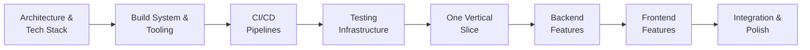

# Quick Start Guide

Essential patterns for AI-assisted development with Cursor. For complete workflow documentation, see [cursor-flow.md](./cursor-flow.md).

## Core Patterns

- **Architecture First**: Define tech stack, API structure, build system before features
- **Atomic Tasks**: AI performs best with small, isolated tasks (one file or subsystem)
- **Plan → Execute → Review**: Generate plan → review/edit → execute one task → review → repeat

> **Full details**: See [Core Principles](./cursor-flow.md#core-principles) in cursor-flow.md

## Development Order

> **Full details**: See [Development Order](./cursor-flow.md#development-order) in cursor-flow.md

## Essential Workflow

1. **Plan** → Generate plan with Composer (Plan mode)
2. **Review** → Refine plan, split into atomic tasks
3. **Execute** → One task at a time with Composer (Agent mode)
4. **Validate** → Run `pnpm lint:fix`, `pnpm typecheck`, `pnpm build`
5. **Repeat** → Move to next task

> **Full details**: See [Plan → Execute → Review Loop](./cursor-flow.md#plan--execute--review-loop) and [Phase 3: Execution](./cursor-flow.md#phase-3-execution) in cursor-flow.md

## Atomic Task Examples

Each task should focus on one file or small subsystem:

- ✅ "Convert load-env.ts to ESM syntax"
- ✅ "Create POST /wallets/{id}/transfer endpoint and tests"
- ✅ "Implement Zod schema for CreateWalletRequest"
- ❌ "Implement user authentication and wallet management"

> **Full details**: See [Atomic Task Guidelines](./cursor-flow.md#atomic-task-guidelines) in cursor-flow.md

## Next Steps

- **Complete Workflow**: Read [cursor-flow.md](./cursor-flow.md) for all phases, commands, and best practices
- **Extensions**: See [extensions.md](./extensions.md) for tool setup
- **Navigation**: Return to [guides/README.md](./README.md) for overview
