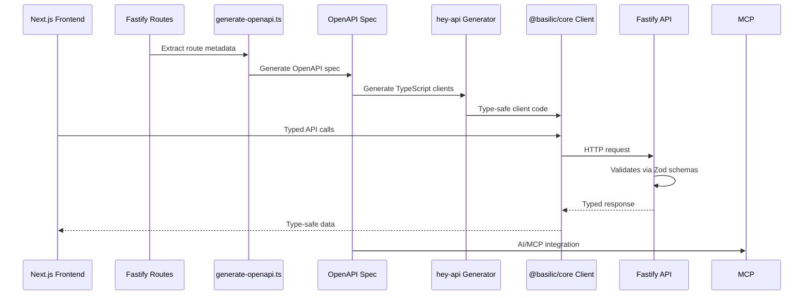

Our API architecture uses **Fastify routes** as the source of truth, with **OpenAPI** generated from routes and **hey-api** for client generation, ensuring end-to-end type safety from routes to generated clients. This approach enables automatic OpenAPI spec generation and TypeScript client generation for AI/MCP integration.

## Code-First Approach

**Fastify routes**, **OpenAPI generation**, and **hey-api** enable code-first development:

- ✅ **Type-safe contracts** - End-to-end type safety from routes → OpenAPI spec → generated clients
- ✅ **Routes as source of truth** - Fastify routes define the API, OpenAPI spec is generated automatically
- ✅ **Automatic OpenAPI generation** - OpenAPI spec generated from route definitions via `generate-openapi.ts`
- ✅ **Automatic client generation** - hey-api generates fully typed TypeScript clients from the generated spec
- ✅ **OpenAPI standard** - Industry-standard format for API contracts
- ✅ **Framework portability** - Works with Fastify, Express, or any framework

## REST-First Philosophy

We chose **REST** as the primary API interface:

- ✅ **Simple** - Standard HTTP, easy to understand
- ✅ **Cacheable** - HTTP caching works out of the box
- ✅ **MCP-friendly** - AI agents prefer simple REST endpoints
- ✅ **Well-understood** - Familiar patterns for developers
- ✅ **GraphQL available** - Can add GraphQL layer if needed, but REST is primary

## API Flow



## OpenAPI Specification

OpenAPI specs are generated in `apps/api/openapi/openapi.json` from Fastify routes via `generate-openapi.ts`:

```json
{
  "openapi": "3.0.0",
  "info": {
    "title": "API",
    "version": "1.0.0"
  },
  "paths": {
    "/users/{id}": {
      "get": {
        "summary": "Get user by id",
        "parameters": [
          {
            "name": "id",
            "in": "path",
            "required": true,
            "schema": { "type": "string" }
          }
        ],
        "responses": {
          "200": {
            "description": "User found",
            "content": {
              "application/json": {
                "schema": {
                  "type": "object",
                  "properties": {
                    "id": { "type": "string" },
                    "email": { "type": "string" }
                  }
                }
              }
            }
          }
        }
      }
    }
  }
}
```

## Client Generation

hey-api generates TypeScript clients from OpenAPI specs:

- Type-safe client code generated in `packages/core/src/gen/`
- React Query hooks generated in `packages/react/src/gen/`
- Full type safety from OpenAPI schemas

## Server Implementation

Fastify routes are the source of truth:

- Routes implemented in `apps/api/src/routes/` with schemas and metadata
- OpenAPI spec automatically generated from route definitions
- Type-safe request/response handling via route schemas
- Validation uses Zod schemas defined in routes

## Client Consumption

Frontend consumes the API via generated clients from `@basilic/core` and `@basilic/react`:

```typescript
import { createApi } from '@basilic/core'
import { useHealthCheck } from '@basilic/react'

// Runtime-agnostic client
const api = createApi({
  baseUrl: process.env.NEXT_PUBLIC_API_URL!,
})

// Fully typed API call
const health = await api.healthCheck()

// Or use generated React Query hooks
const { data } = useHealthCheck()
// data is typed from OpenAPI spec
```

## OpenAPI Integration

**OpenAPI 3.0 specs** are automatically generated:

- **Programmatic access** - Served via `@fastify/swagger` plugin at `/openapi.json`
- **Interactive docs** - Swagger UI via `@fastify/swagger-ui` at `/docs` or `/api-docs`
- **MCP integration** - OpenAPI specs enable AI agents to interact with API
- **Multi-language SDKs** - OpenAPI specs can generate clients in Python, Go, Rust, etc.

## Multi-Language SDK Strategy

Designed for projects that need to publish SDKs in multiple languages.

### TypeScript-First Approach

**TypeScript**: Generated by `@hey-api/openapi-ts` from the generated OpenAPI spec. Benefits: full type safety, automatic updates when routes change (which regenerate the spec), excellent IDE experience. Routes are the source of truth, OpenAPI spec is generated from routes.

### OpenAPI for Other Languages

Use standard OpenAPI generators:
- **Go**: `oapi-codegen`, `openapi-generator`
- **Rust**: `openapi-generator`, `progenitor`
- **Python**: `openapi-generator`, `datamodel-code-generator`
- **Java/C#**: `openapi-generator`, `NSwag`

### Philosophy

**Fastify routes** = Source of truth. **OpenAPI spec** = Generated from routes. **hey-api** generates TypeScript clients from the spec. **Standard generators** create clients for other languages from the same generated spec. All clients generated from the same OpenAPI spec (which is generated from routes), always in sync.

## AI/MCP Integration

REST endpoints with OpenAPI specs enable AI agents to discover, call, and validate API endpoints via Model Context Protocol (MCP).

## Related Documentation

- [Backend Stack](/docs/architecture/backend-stack) - Fastify implementation
- [Package Conventions](/docs/architecture/package-conventions) - Package architecture and client generation
