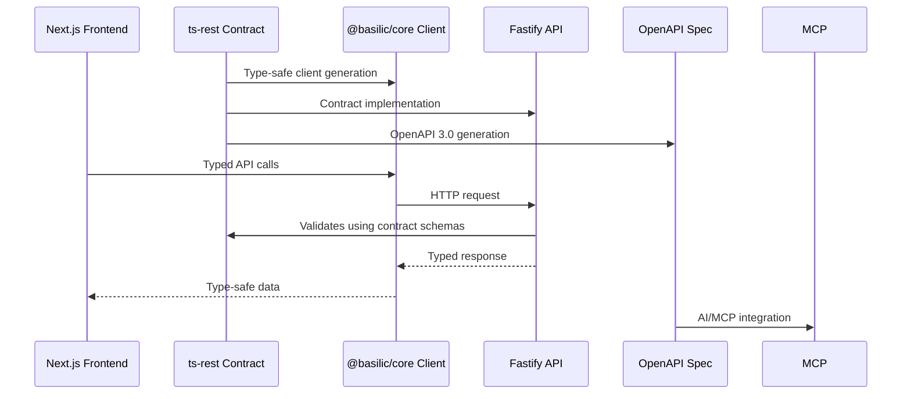

Our API architecture uses **ts-rest** for contract-first development, ensuring end-to-end type safety from contracts to clients. This approach enables automatic OpenAPI generation for AI/MCP integration while maintaining clear separation between API contracts and implementation.

## Contract-First Approach

**ts-rest** enables contract-first development:

- ✅ **Type-safe contracts** - End-to-end type safety from contracts to clients
- ✅ **Separation of concerns** - Contracts live separately from implementation
- ✅ **Automatic client generation** - Frontend gets fully typed clients automatically
- ✅ **OpenAPI generation** - Contracts automatically generate OpenAPI 3.0 specs
- ✅ **Framework portability** - Works with Fastify, Express, or any framework

## REST-First Philosophy

We chose **REST** as the primary API interface:

- ✅ **Simple** - Standard HTTP, easy to understand
- ✅ **Cacheable** - HTTP caching works out of the box
- ✅ **MCP-friendly** - AI agents prefer simple REST endpoints
- ✅ **Well-understood** - Familiar patterns for developers
- ✅ **GraphQL available** - Can add GraphQL layer if needed, but REST is primary

## API Flow



## Contract Definition

Contracts are defined in `packages/contracts`:

```typescript
import { initContract } from '@ts-rest/core'
import { z } from 'zod'

const c = initContract()

export const apiContract = c.router({
  users: {
    get: {
      method: 'GET',
      path: '/users/:id',
      pathParams: z.object({ id: z.string() }),
      responses: {
        200: z.object({ 
          id: z.string(), 
          email: z.string() 
        }),
        404: z.object({ 
          code: z.string(), 
          message: z.string() 
        }),
      },
      summary: 'Get user by id',
    },
  },
})
```

## Server Implementation

Fastify implements contracts using `@ts-rest/fastify`:

- Routes generated from contracts
- Type-safe request/response handling
- Automatic validation via Zod schemas

## Client Consumption

Frontend consumes contracts via `@basilic/core` and `@basilic/react`:

```typescript
import { createReactApi } from '@basilic/react'

const api = createReactApi({
  baseUrl: process.env.NEXT_PUBLIC_API_URL!,
})

// Fully typed React Query hook
const { data } = api.tsr.users.get.useQuery({
  queryKey: ['users', id],
  queryData: { params: { id } },
})
// data is typed as { id: string, email: string }
```

## OpenAPI Integration

**OpenAPI 3.0 specs** are automatically generated:

- **Programmatic access** - Served via `@fastify/swagger` plugin at `/openapi.json`
- **Interactive docs** - Swagger UI via `@fastify/swagger-ui` at `/docs` or `/api-docs`
- **MCP integration** - OpenAPI specs enable AI agents to interact with API
- **Multi-language SDKs** - OpenAPI specs can generate clients in Python, Go, Rust, etc.

## Multi-Language SDK Strategy

Designed for projects that need to publish SDKs in multiple languages.

### TypeScript-First Approach

**TypeScript**: Import contracts directly (zero codegen). Benefits: instant type updates, better IDE experience, smaller bundles. Contracts are the source of truth.

### OpenAPI for Other Languages

Use standard OpenAPI generators:
- **Go**: `oapi-codegen`, `openapi-generator`
- **Rust**: `openapi-generator`, `progenitor`
- **Python**: `openapi-generator`, `datamodel-code-generator`
- **Java/C#**: `openapi-generator`, `NSwag`

### Philosophy

**ts-rest contracts** = Source of truth for TypeScript (zero codegen). **OpenAPI specs** = First-class export for other languages (standard codegen). OpenAPI automatically generated from contracts, always in sync.

## AI/MCP Integration

REST endpoints with OpenAPI specs enable AI agents to discover, call, and validate API endpoints via Model Context Protocol (MCP).

## Related Documentation

- [Backend Stack](/docs/architecture/backend-stack) - Fastify implementation
- [Package Architecture](/docs/architecture) - Contract package structure
- [ADR 009: API Architecture](/docs/adrs/009-api-architecture) - Full decision record
