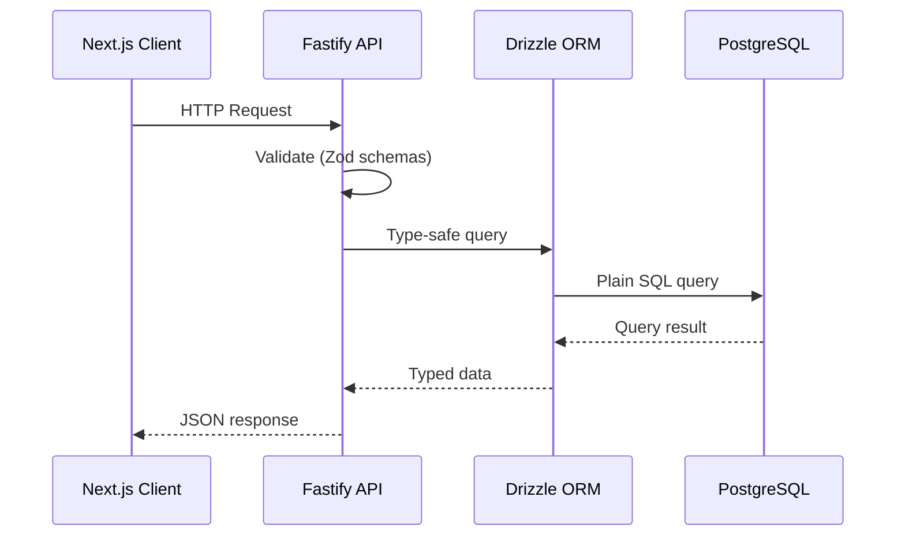

The backend uses **Node.js LTS** with **Fastify**, **PostgreSQL**, and **Drizzle ORM**. These standard technologies ensure portability and type safety, allowing migration between deployment platforms without code changes.

## Technology Choices

### Runtime: Node.js LTS

**Node.js LTS** provides:

- ✅ **Stability** - Long-term support with predictable release cycles
- ✅ **Ecosystem** - Largest npm package ecosystem with 100% compatibility
- ✅ **Enterprise support** - Wide adoption and professional support available
- ✅ **Tooling** - Best-in-class debugging, monitoring, and APM tools
- ✅ **Cloud support** - Universal support across AWS, GCP, Azure

### Framework: Fastify

**Fastify** is a fast, low-overhead web framework for Node.js:

- ✅ **Portability** - Runs anywhere (Vercel, Google Cloud Run, AWS ECS, on-premises)
- ✅ **No vendor lock-in** - Standard Node.js app, migrate by changing deployment only
- ✅ **Performance** - Fast, low overhead, production-ready
- ✅ **Functional patterns** - Plugin-based architecture, no classes required
- ✅ **TypeScript support** - Excellent type inference and developer experience
- ✅ **OpenAPI support** - Via plugins for API documentation and AI integration

### Database: PostgreSQL

**PostgreSQL** provides:

- ✅ **ACID transactions** - Full transactional integrity
- ✅ **Extensions** - PostGIS, vector search, full-text search, crypto
- ✅ **Enterprise ready** - Mature, battle-tested, widely supported
- ✅ **Portability** - Standard SQL, works with any PostgreSQL host

### Initial Provider: Supabase

**Supabase** accelerates development:

- ✅ **Managed Postgres** - Fast setup for rapid iteration
- ✅ **Branching** - Preview environments with database branching
- ✅ **Local development** - Supabase CLI for local Postgres
- ✅ **Migration path** - Easy to migrate to Cloud SQL/RDS (only `DATABASE_URL` changes)

### ORM: Drizzle

**Drizzle ORM** provides type-safe database access:

- ✅ **Type safety** - Full TypeScript inference, no code generation
- ✅ **Lightweight** - Minimal runtime overhead
- ✅ **SQL-like syntax** - Intuitive and familiar
- ✅ **Zero vendor lock-in** - Generates plain PostgreSQL queries
- ✅ **PGLite support** - Works with embedded Postgres for testing

## Architecture Flow



## Backend Request Flow

1. **Request arrives** - Fastify receives HTTP request
2. **Validation** - Zod schemas validate request body/params
3. **Business logic** - Handler processes request
4. **Database access** - Drizzle executes type-safe queries
5. **Response** - Typed JSON response returned

## Database Schema Management

Schemas are defined using Drizzle's declarative syntax:

```typescript
import { pgTable, text, timestamp } from 'drizzle-orm/pg-core'

export const users = pgTable('users', {
  id: text('id').primaryKey(),
  email: text('email').notNull(),
  createdAt: timestamp('created_at').defaultNow().notNull(),
})
```

Migrations are managed with `drizzle-kit`:

- `db:generate` - Generate migration files from schema changes
- `db:migrate` - Apply migrations to database

## Portability Strategy

The entire backend stack is designed for **zero vendor lock-in**:

- **Fastify** - Standard Node.js process, runs anywhere
- **Drizzle** - Generates plain SQL, no proprietary runtime
- **PostgreSQL** - Standard SQL, works with any Postgres host
- **Migration** - Only requires changing `DATABASE_URL`

See [Portability Strategy](/docs/architecture/portability) for detailed migration paths.

## Related Documentation

- [API Contracts](/docs/architecture/api-contracts) - Contract-first API development
- [Portability Strategy](/docs/architecture/portability) - Migration and portability details
