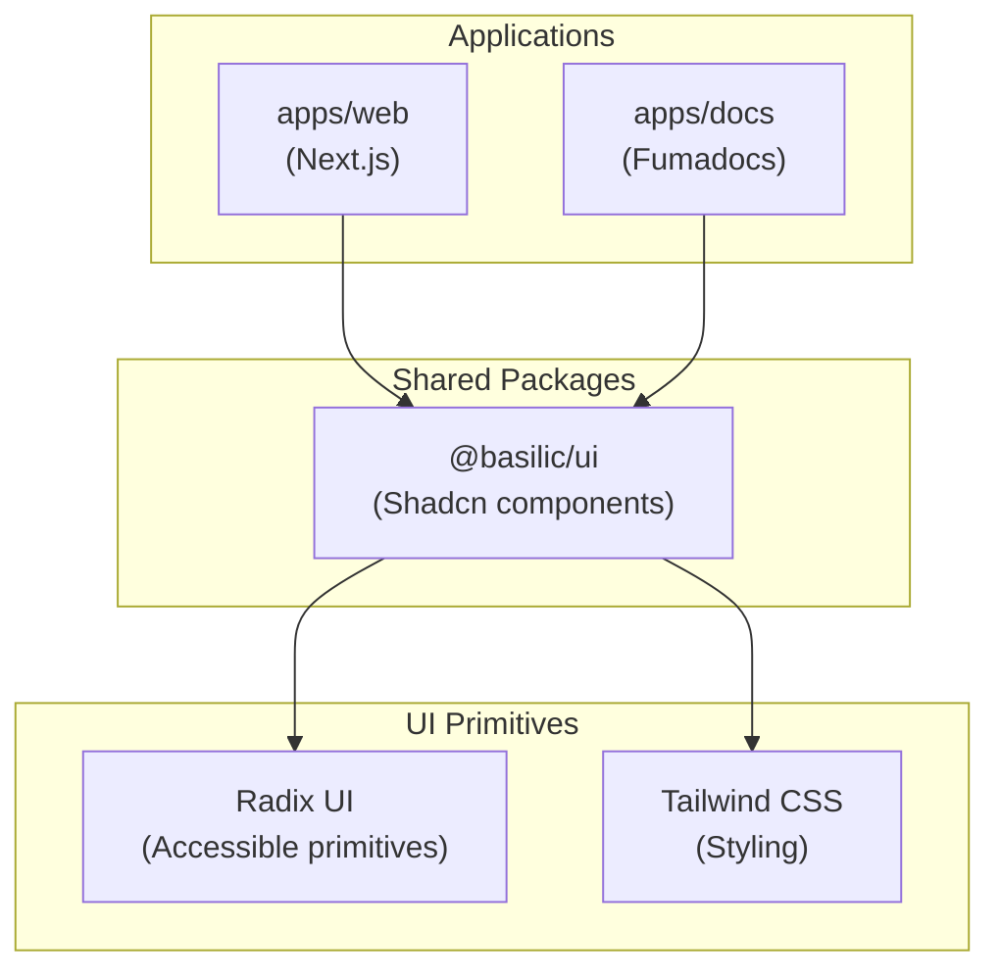

Frontend applications use **Next.js** with the **Shadcn/ui** component library and **Tailwind CSS**. This combination enables rapid AI-assisted development through v0 integration while maintaining full component ownership.

## Technology Choices

### Framework: Next.js

**Next.js** provides a full-stack React framework with:

- ✅ **React Server Components** - Modern React patterns with server-side rendering
- ✅ **App Router** - File-based routing with layouts and nested routes
- ✅ **Turbopack** - Fast builds and development server
- ✅ **Built-in optimizations** - Image optimization, font optimization, code splitting
- ✅ **TypeScript support** - Excellent type safety out of the box
- ✅ **Monorepo integration** - Works seamlessly with Turborepo and pnpm workspaces

### Design System: Shadcn/ui + Tailwind CSS

**Shadcn/ui** is a copy-paste component library built on:

- ✅ **Component ownership** - Components copied into codebase, full control
- ✅ **No vendor lock-in** - No external dependency versioning
- ✅ **v0 integration** - Seamless workflow from AI-generated prototypes to production
- ✅ **Radix UI primitives** - Accessible components by default
- ✅ **Tailwind CSS** - Utility-first CSS for rapid styling
- ✅ **Customizable** - Easy to modify and extend components

## Why v0 Integration Matters

**v0** (Vercel's AI UI generator) was a key factor in choosing Next.js + Shadcn/ui:

- v0 generates **Next.js + Shadcn/ui** components
- Enables rapid prototyping with AI assistance
- Seamless workflow: AI prototype → production code
- Components are immediately usable and customizable

This integration accelerates development by allowing AI to generate production-ready UI components that follow our design system.

## Component Architecture

## Component Organization

Components are organized in the `@basilic/ui` package:

- **Base components** - Button, Input, Card, etc. (from Shadcn/ui)
- **Custom components** - Domain-specific components built on base
- **Shared across apps** - Used by `apps/web`, `apps/docs`, and other frontend apps

## Development Workflow

1. **AI prototyping** - Use v0 to generate component ideas
2. **Component copy** - Copy Shadcn/ui components into `@basilic/ui`
3. **Customization** - Modify components to match design requirements
4. **Usage** - Import components in Next.js apps
5. **Sharing** - Components available across all frontend apps

## Styling with Tailwind CSS

**Tailwind CSS** provides:

- **Utility-first** - Rapid styling with utility classes
- **Design tokens** - Consistent spacing, colors, typography
- **Responsive design** - Mobile-first breakpoints
- **Dark mode** - Built-in dark mode support
- **Performance** - Only includes used styles in production bundle

## TypeScript Integration

Full type safety throughout:

- **Component props** - Fully typed component interfaces
- **Next.js routes** - Type-safe routing with App Router
- **API clients** - Type-safe API calls via ts-rest contracts
- **Shared types** - Domain types from `@basilic/types`

## Related Documentation

- [Monorepo Structure](/docs/architecture/monorepo) - Package organization
- [ADR 003: Frontend Framework](/docs/adrs/003-frontend-framework) - Next.js selection
- [ADR 004: Design System](/docs/adrs/004-design-system) - Shadcn/ui selection
