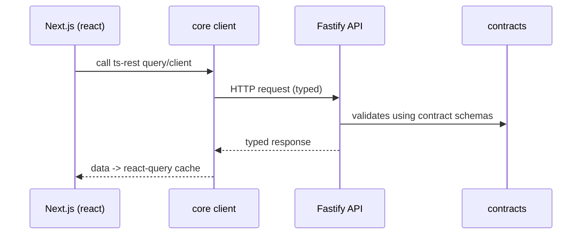

# Monorepo Conventions: types / contracts / core / react

This document defines the conventions and package architecture for a **TypeScript + ESM** monorepo that uses:

* **Fastify** (server)
* **ts-rest** (contract-first API)
* **Zod** (runtime schemas)
* **TanStack Query** (React data fetching)
* **tsup** (package builds for npm)

Goal: **clean boundaries**, **no duplication**, **portable** across runtimes, and **fast DX** in a monorepo while still producing **dist-only** packages for publishing.

## Why this architecture

We want three outcomes at the same time:

1. **Single source of truth** for API shapes (request/response) with runtime validation.
2. Apps across the monorepo can import types safely without dragging server/runtime dependencies everywhere.
3. Packages compile to clean ESM artifacts for npm (but we can still do fast local dev in the monorepo).

The key idea:

* **Domain types** are pure TypeScript.
* **API shapes** live in **contracts** and are derived from **Zod schemas** (no duplication).
* **core** provides the **ts-rest client**.
* **react** provides **TanStack Query** helpers/hooks.

## Package layout

```
packages/
  types/       # pure TS domain types (no zod, no ts-rest)
  contracts/   # ts-rest routers + zod schemas (API boundary)
  core/        # ts-rest client (runtime-agnostic)
  react/       # react-query wrappers (React-only)
apps/
  api/         # Fastify server implementing contracts
  web/         # Next.js app consuming core/react
```

### Dependency direction (strict)

* `types` → depends on nothing
* `contracts` → may depend on `types`
* `core` → depends on `contracts`
* `react` → depends on `core` and `contracts`

No reverse dependencies.

## Mermaid architecture diagram

```mermaid
flowchart TB
  subgraph P[packages]
    T[types
(pure TS domain)]
    C[contracts
(ts-rest + zod)]
    K[core
(ts-rest client)]
    R[react
(TanStack Query)]
  end

  subgraph A[apps]
    API[api
(Fastify)]
    WEB[web
(Next.js)]
  end

  T --> C
  C --> K
  K --> R

  C --> API
  API -->|OpenAPI JSON| DOCS[Scalar UI]

  R --> WEB
  K --> WEB
  WEB -->|HTTP| API
```

## Package responsibilities

### 1) `packages/types`

**What goes here**

* Domain models and shared non-HTTP types: `User`, `Wallet`, `ChainId`, `Money`, etc.

**Hard rules**

* ✅ TypeScript `type`/`interface` only
* ❌ No `zod`
* ❌ No `ts-rest`
* ❌ No runtime helpers

**Example**

```ts
// packages/types/src/index.ts
export type UserId = string;

export interface User {
  id: UserId;
  email: string;
}

export type ApiErrorCode =
  | "UNAUTHORIZED"
  | "NOT_FOUND"
  | "VALIDATION_ERROR"
  | "INTERNAL_ERROR";

export interface ApiError {
  code: ApiErrorCode;
  message: string;
  requestId?: string;
}
```

### 2) `packages/contracts`

This is the **HTTP boundary**.

**What goes here**

* Zod schemas for requests and responses
* ts-rest routers that reference those schemas
* shared API error schemas
* OpenAPI metadata (tags/summary/description)

**Hard rules**

* ✅ Allowed: `zod`, `@ts-rest/core`
* ✅ May import domain interfaces from `types`
* ❌ No React
* ❌ No server framework code (Fastify/Elysia/etc.)

**Pattern: derive types from schemas (no duplication)**

```ts
// packages/contracts/src/schemas/user.schema.ts
import { z } from "zod";

export const UserSchema = z.object({
  id: z.string(),
  email: z.string().email(),
});

export type UserDTO = z.infer<typeof UserSchema>;
```

If you want to ensure your domain type matches a schema, you can do this:

```ts
import type { User } from "@acme/types";

export const UserSchema = z.object({
  id: z.string(),
  email: z.string().email(),
}) satisfies z.ZodType<User>;
```

**Shared error schema**

```ts
// packages/contracts/src/schemas/error.schema.ts
import { z } from "zod";

export const ApiErrorSchema = z.object({
  code: z.enum(["UNAUTHORIZED", "NOT_FOUND", "VALIDATION_ERROR", "INTERNAL_ERROR"]),
  message: z.string(),
  requestId: z.string().optional(),
});

export type ApiErrorDTO = z.infer<typeof ApiErrorSchema>;
```

**ts-rest contract**

```ts
// packages/contracts/src/contracts/app.contract.ts
import { initContract } from "@ts-rest/core";
import { z } from "zod";
import { UserSchema } from "../schemas/user.schema";
import { ApiErrorSchema } from "../schemas/error.schema";

const c = initContract();

export const appContract = c.router({
  users: {
    getUser: {
      method: "GET",
      path: "/users/:id",
      pathParams: z.object({ id: z.string() }),
      responses: {
        200: UserSchema,
        404: ApiErrorSchema,
      },
      summary: "Get user by id",
    },
  },
});
```

**Public exports**

```ts
// packages/contracts/src/index.ts
export * from "./contracts/app.contract";
export * from "./schemas/user.schema";
export * from "./schemas/error.schema";
```

### 3) `packages/core`

The **runtime-agnostic** client package.

**What goes here**

* `createClient({ baseUrl, getAuthToken, getHeaders })`
* shared fetch behavior (headers, auth, retries if you want)

**Hard rules**

* ✅ No React
* ✅ No TanStack
* ✅ OK to be used in Node, Next, Workers (depending on fetch)

**Example**

```ts
// packages/core/src/client.ts
import { initClient } from "@ts-rest/core";
import { appContract } from "@acme/contracts";

export type CoreClientOptions = {
  baseUrl: string;
  getAuthToken?: () => string | null | Promise<string | null>;
  getHeaders?: () => Record<string, string> | Promise<Record<string, string>>;
};

export function createClient(opts: CoreClientOptions) {
  return initClient(appContract, {
    baseUrl: opts.baseUrl,
    baseHeaders: async () => {
      const [token, extra] = await Promise.all([
        opts.getAuthToken?.(),
        opts.getHeaders?.(),
      ]);

      return {
        ...(extra ?? {}),
        ...(token ? { Authorization: `Bearer ${token}` } : {}),
      };
    },
  });
}
```

```ts
// packages/core/src/index.ts
export { createClient } from "./client";
export type { CoreClientOptions } from "./client";
```

### 4) `packages/react`

React-only helpers using **TanStack Query**.

**What goes here**

* query client init for ts-rest
* hooks wrapper patterns
* shared query keys (optional)

**Hard rules**

* ✅ React-only dependencies live here
* ✅ `@tanstack/react-query` belongs here

**Example**

```ts
// packages/react/src/index.ts
import { initQueryClient } from "@ts-rest/react-query";
import { appContract } from "@acme/contracts";
import { createClient, type CoreClientOptions } from "@acme/core";

export function createReactApi(opts: CoreClientOptions) {
  const client = createClient(opts);
  const tsr = initQueryClient(appContract, opts);
  return { client, tsr };
}
```

Then in the web app:

```ts
const api = createReactApi({
  baseUrl: process.env.NEXT_PUBLIC_API_URL!,
  getAuthToken: async () => /* read session */ null,
});

api.tsr.users.getUser.useQuery({
  queryKey: ["users.getUser", id],
  queryData: { params: { id } },
});
```

## Server implementation (Fastify) uses the same contract

The server app (`apps/api`) should:

1. import the `appContract`
2. implement routes to match the contract
3. expose OpenAPI JSON
4. mount Scalar UI

### Multi-Language SDK Philosophy

**TypeScript consumers** import contracts directly with **zero codegen** for the best DX.

**Other languages** (Go, Rust, Python) generate SDKs from the OpenAPI spec when needed.

This gives us:
- ✅ No generated code in TypeScript
- ✅ Full type safety via ts-rest
- ✅ OpenAPI always available for non-TS consumers

See **[ADR 009: API Architecture](/docs/adrs/009-api-architecture#multi-language-sdk-strategy)** for detailed philosophy and implementation strategy.

### Mermaid: request flow



## ESM + tsup build strategy

We want:

* **ESM-first** packages
* **tsup builds** for publishing to npm
* **fast monorepo DX** (direct imports) without needing to build constantly

### Monorepo source exports + prepack for npm

### Package `package.json` (monorepo/dev)

```json
{
  "name": "@acme/contracts",
  "type": "module",
  "exports": {
    ".": {
      "types": "./src/index.ts",
      "import": "./src/index.ts"
    }
  },
  "scripts": {
    "build": "tsup",
    "prepack": "pnpm build && node ../../scripts/prepare-publish.mjs"
  }
}
```

### tsup config (ESM + d.ts)

```ts
// packages/contracts/tsup.config.ts
import { defineConfig } from "tsup";

export default defineConfig({
  entry: ["src/index.ts"],
  format: ["esm"],
  dts: true,
  sourcemap: true,
  clean: true,
  outDir: "dist",
});
```

### Prepack script: switch exports to dist

```js
// scripts/prepare-publish.mjs
import fs from "node:fs";
import path from "node:path";

const pkgPath = path.resolve(process.cwd(), "package.json");
const pkg = JSON.parse(fs.readFileSync(pkgPath, "utf8"));

pkg.exports = {
  ".": {
    "types": "./dist/index.d.ts",
    "import": "./dist/index.js"
  }
};

pkg.main = "./dist/index.js";
pkg.types = "./dist/index.d.ts";
pkg.files = ["dist"];

fs.writeFileSync(pkgPath, JSON.stringify(pkg, null, 2) + "\n");
```

> Convention: `prepack` runs inside each package when publishing, so the script uses `process.cwd()`.

## Important dev/runtime note

If your server (`apps/api`) imports workspace packages that export `src/*.ts`, then **Node cannot run that TypeScript** unless you:

* run the server with a TS runtime like `tsx` in dev, or
* switch to Approach B and build packages for dev.

Recommended dev command for Fastify:

```json
{
  "scripts": {
    "dev": "tsx watch src/server.ts"
  }
}
```

## Next.js consumption rules

Next.js should transpile workspace packages:

```js
// apps/web/next.config.js
module.exports = {
  transpilePackages: [
    "@acme/types",
    "@acme/contracts",
    "@acme/core",
    "@acme/react"
  ],
};
```

This keeps DX smooth without having to prebuild packages.

## Import conventions (do this, not that)

### Domain types

✅

```ts
import type { User } from "@acme/types";
```

### API-derived DTO types

✅

```ts
import type { UserDTO } from "@acme/contracts";
```

### Avoid leaking contracts runtime

* In non-HTTP domain code, prefer importing from `types`.
* Only import from `contracts` when you are working on API boundary shapes.

## Checklist for new endpoints

When you add a new endpoint:

1. Add schemas in `packages/contracts/src/schemas/...`
2. Add route definition in `packages/contracts/src/contracts/...`
3. Implement route handler in `apps/api`
4. Add client usage via `packages/core`
5. Add React Query usage via `packages/react` or directly in apps

## Example: Health Check Endpoint

The health check endpoint demonstrates the full monorepo pattern:

**1. Contract Definition** (`packages/contracts`)

```ts
// packages/contracts/src/schemas/health.schema.ts
export const HealthResponseSchema = z.object({
  ok: z.literal(true),
  now: z.string().datetime(),
})

// packages/contracts/src/contracts/app.contract.ts
export const appContract = c.router({
  health: {
    check: {
      method: 'GET',
      path: '/health',
      responses: { 200: HealthResponseSchema },
      summary: 'Health check endpoint',
    },
  },
})
```

**2. Server Implementation** (`apps/api`)

```ts
// apps/api/src/routes/health.ts
const router = s.router(appContract, {
  health: {
    check: async () => ({
      status: 200 as const,
      body: { ok: true, now: new Date().toISOString() },
    }),
  },
})
```

**3. Client Usage** (`apps/web` or other consumers)

```tsx
const api = createReactApi({ baseUrl: process.env.NEXT_PUBLIC_API_URL! })

// React Query hook
const { data } = api.tsr.health.check.useQuery({
  queryKey: ['health'],
})
// data is typed as { ok: true, now: string }
```

**OpenAPI Documentation**

- OpenAPI JSON available at `GET /openapi.json`
- Interactive Scalar UI at `GET /openapi`
- Automatically generated from ts-rest contracts

## Summary

* `types` stays clean: **no runtime, no API boundary**
* `contracts` is the API spec: **Zod + ts-rest**, derive DTO types from schemas
* `core` is the shared client: **runtime-agnostic**
* `react` is the React layer: **TanStack Query**
* ESM everywhere
* tsup builds dist for npm
* monorepo dev can use source exports + `prepack` switch (Approach A)

This architecture stays portable and keeps your boundaries sharp as the codebase grows.

## Related Documentation

- [Monorepo Structure](/docs/monorepo) - High-level monorepo overview
- [Contract-First APIs](/docs/contracts) - Contract-first development approach
- [Architecture Overview](/docs/architecture) - All architecture topics
