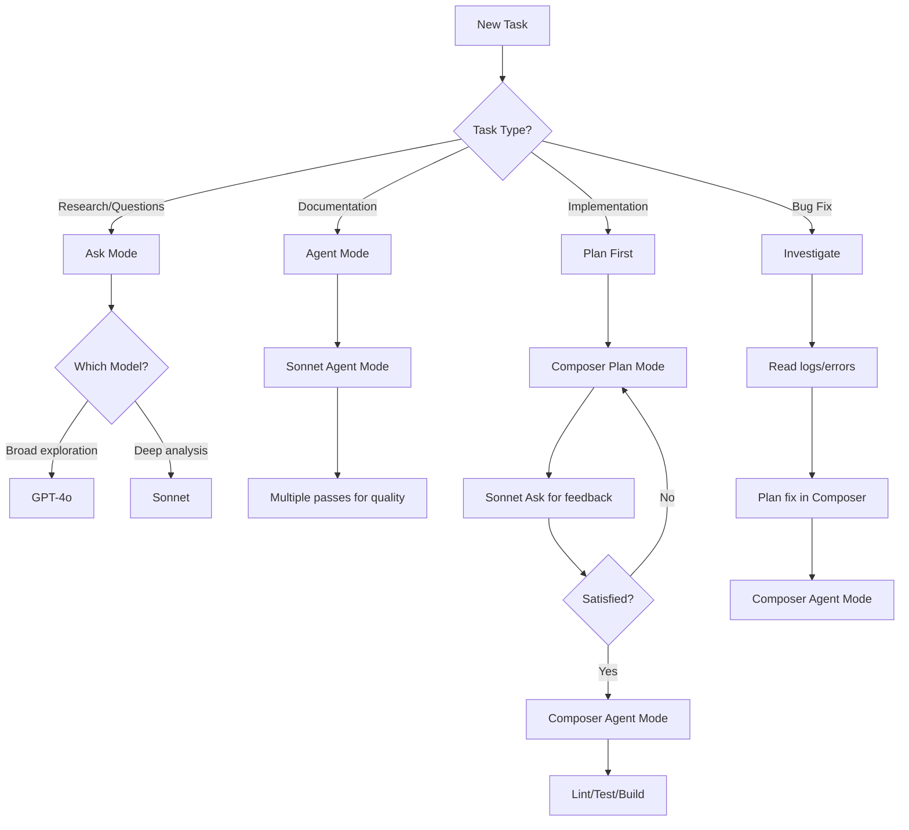
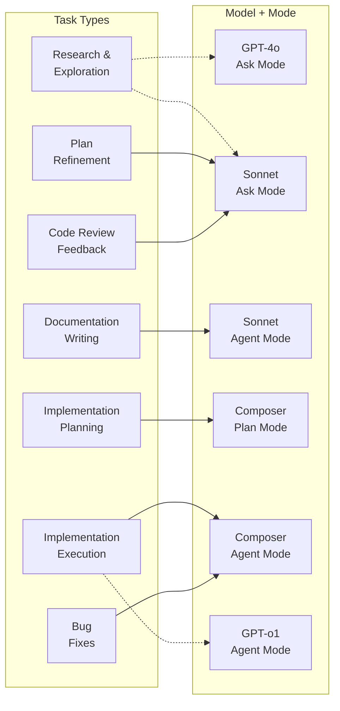
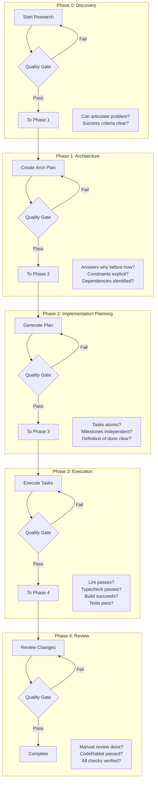

> **Navigation**: [← Workflow Overview](/docs/cursor-workflow) | [Quick Start](/docs/cursor-workflow/quick-start) | [Extensions](/docs/cursor-workflow/extensions)

## Overview

This is the **authoritative reference** for AI-assisted development workflows in this codebase. It provides comprehensive coverage of the complete development lifecycle, including discovery, architecture, planning, execution, and review phases.

**Audience**: This is a guide for humans operating Cursor AI. It defines how to effectively collaborate with AI agents throughout the development lifecycle.

**Note**: This repository has comprehensive rules, skills, and commands already configured. This workflow explains how to use them effectively.

> **Quick Reference**: For a condensed overview, see [Quick Start](/docs/cursor-workflow/quick-start). For extension setup, see [Extensions](/docs/cursor-workflow/extensions).

## Understanding Cursor Components

### Mental Model

> **Rules define *how the AI must behave*, Skills add *what it knows*, and Commands decide *when and where it acts*.** When there's any conflict, **Rules always win**.

### Component Priority Hierarchy

```
1. RULES   (hard constraints, always enforced)
2. SKILLS  (knowledge, heuristics, best practices)
3. COMMANDS (task + scope trigger)
```

### Component Details Table

| Component | Purpose | What it Controls | Priority | Conflict Behavior | Scope | Status in This Repo |
|---------|---------|------------------|----------|-------------------|-------|--------------------|
| Rules | Hard constraints and guardrails | Architecture, patterns, tech choices, file structure, style, tone | Highest | Always overrides skills and commands | Repo-scoped | Fully defined, authoritative source of truth |
| Skills | Knowledge and best practices | APIs, idioms, heuristics, common pitfalls | Medium | Blended heuristically, resolved by rules | Global or repo-local | Support-only, adapted to repo rules |
| Commands | Task invocation and scoping | When the AI runs, task type, included context/files | Lowest | Cannot override rules or skills | Per invocation | Used only as execution triggers |

### How Components Work Together

**Rules (Highest Priority)**
- Deterministic constraints that shape AI behavior
- Hard guardrails, not suggestions
- Control architecture decisions, coding style, file structure, tech choices
- "Never do X", "Always do Y"
- Read first, act as filter over all reasoning
- **This repo's rules are intentional and non-negotiable**

**Skills (Knowledge Layer)**
- Reusable knowledge bundles for specific technologies
- Provide APIs, idioms, best practices, common pitfalls
- Improve correctness and speed
- Do not override each other deterministically
- **Adapt to repo rules, not the other way around**

**Commands (Execution Triggers)**
- Entry points for interaction (slash commands, Composer, Chat)
- Control when AI runs and which context is included
- Define the task, not the behavior
- Cannot bypass rules or force skill opinions
- **Execute under the rules of this repo**

### Why This Matters

This setup provides:
- **Consistency**: Deterministic behavior across all AI models
- **Portability**: Rules travel with the repo
- **Predictability**: Clear priority hierarchy prevents conflicts
- **Safety**: Rules guard against unintended changes
- **Scale**: Lower cognitive load for team collaboration

## Core Principles

- **Start with Why**: Purpose and constraints before technical details
- **Progressive Refinement**: Idea → Features → Technical Plan → Execution
- **Right Tool for Right Job**: Model selection based on task type
- **Plan as Living Document**: Iterative refinement with validation gates
- **Leverage Existing Tools**: Custom commands and skills at appropriate phases
- **Architecture First**: Define tech stack, API structure, build system before features
- **Atomic Tasks**: AI performs best with small, isolated tasks (one file or subsystem)
- **Plan → Execute → Review**: Generate plan → review/edit → execute one task → review → repeat

## Model Selection Framework

| Task Type | Model | Mode | Notes |
|-----------|-------|------|-------|
| General questions & research | GPT 5.2 | Ask | General knowledge, fast exploration |
| Deep research & documentation | Sonnet | Ask/Agent | Cost-effective, excellent prose |
| Codebase questions | Composer | Ask | 90% of usage - code context awareness |
| Planning (all types) | Composer/Sonnet | Plan | Composer for code-aware drafts, Sonnet for refinement |
| Implementation | Composer | Agent | Execute plans, code generation |
| Documentation writing | Sonnet | Agent | Superior information architecture |
| Code-aware documentation drafts | Composer | Agent | Initial draft, then refine with Sonnet |
| Long-running tasks (>100 steps) | GPT 5.2 Codex | Agent | Requires very specific, detailed plan |
| Bug investigation & fixes | Composer | Debug | Runtime instrumentation, hypothesis testing |

## Complete Workflow Overview

```mermaid
flowchart TD
    Start([Start New Feature]) --> Phase0[Phase 0: Discovery]
    
    Phase0 --> Research[Research with GPT/Sonnet Ask Mode]
    Research --> Clarify[Use Clarify Task Framework]
    Clarify --> Document[Document findings]
    Document --> Gate0{Can articulate problem<br/>and success criteria?}
    Gate0 -->|No| Research
    Gate0 -->|Yes| Phase1[Phase 1: Architecture]
    
    Phase1 --> ArchPlan[Create architectural plan]
    ArchPlan --> Complex{Complex feature?}
    Complex -->|Yes| Systematic[Use Systematic Planning Framework]
    Complex -->|No| Simple[Simple architecture doc]
    Systematic --> ArchIterate[Iterate with Sonnet Ask Mode]
    Simple --> ArchIterate
    ArchIterate --> Gate1{Answers why before how?<br/>Constraints explicit?}
    Gate1 -->|No| ArchPlan
    Gate1 -->|Yes| Phase2[Phase 2: Implementation Planning]
    
    Phase2 --> GenPlan[Generate plan with Composer Plan Mode]
    GenPlan --> ReviewPlan[Review with Sonnet Ask Mode]
    ReviewPlan --> Gate2{Tasks atomic?<br/>Milestones independent?}
    Gate2 -->|No| GenPlan
    Gate2 -->|Yes| ManualReview[Manual review]
    ManualReview --> Gate2b{Satisfied?}
    Gate2b -->|No| GenPlan
    Gate2b -->|Yes| Phase3[Phase 3: Execution]
    
    Phase3 --> Execute[Execute with Composer/Sonnet Agent]
    Execute --> OneTask[One task at a time]
    OneTask --> Validate[Run lint/typecheck/build]
    Validate --> Gate3{All checks pass?}
    Gate3 -->|No| Fix[Fix with Composer Agent]
    Fix --> Validate
    Gate3 -->|Yes| MoreTasks{More tasks?}
    MoreTasks -->|Yes| OneTask
    MoreTasks -->|No| CodeRabbit[Run CodeRabbit extension]
    CodeRabbit --> Phase4[Phase 4: Review]
    
    Phase4 --> PreCommit[Manual review of changes]
    PreCommit --> FinalCheck[Verify lint/tests multiple times]
    FinalCheck --> Commit[Manual commit via CLI]
    Commit --> CreatePR[Create PR manually]
    CreatePR --> AutoReview[CodeRabbit automated review]
    AutoReview --> HasComments{Review comments?}
    HasComments -->|Yes| AskFirst[Ask to clarify feedback]
    AskFirst --> PlanFix[Plan fix with Composer]
    PlanFix --> ExecuteFix[Execute with Composer Agent]
    ExecuteFix --> Validate
    HasComments -->|No| Done([Feature Complete])
```



## Development Phases

### Phase 0: Discovery & Research

**Purpose**: Understand requirements before planning

**Steps**:

1. Use **Ask mode** (GPT/Sonnet) for research questions
2. Invoke `/clarify-task` command to identify unknowns
3. Document findings in feature planning document
4. Ask clarifying questions using AskQuestion patterns

**Quality Gate**: Can you articulate the problem and success criteria clearly?

**Clarify Task Framework**:

Before coding, ask 2-4 multiple choice questions to clarify:
- Data flow and architecture
- APIs and integrations
- Authentication/authorization
- Edge cases and error handling
- UI/UX expectations (if applicable)

Then restate requirements to confirm understanding before proceeding.

**Anti-patterns**:
- ❌ Jumping to implementation without understanding the problem
- ❌ Assuming requirements without validation
- ❌ Skipping research phase for complex features

**Commands**:
- `/clarify-task` - Structured clarification process

### Phase 1: Architectural Planning

**Purpose**: Define "why" and "what" before "how"

**Framework**:

```markdown
## Purpose & Success Criteria
- What problem does this solve?
- How will you measure success?
- What are the constraints?

## Technical Foundation
- Architecture decisions
- Tech stack choices
- Key invariants
```

**Steps**:

1. Create architectural plan document for the feature
2. Use **Ask mode** (Sonnet) to iterate on architecture
3. For complex features, use systematic planning framework (below)
4. Consider using `/diagrams` command for visualization

**Systematic Planning Framework** (for complex features):

```markdown
## Feature: [Name]

### Phase 1: Business Specification
**Problem Statement**: [What problem does this solve?]

**Success Criteria**:
- [ ] [Measurable outcome 1]
- [ ] [Measurable outcome 2]

**Scope**:
- In Scope: [what's included]
- Out of Scope: [what's NOT included]

**Constraints**:
- [Technical constraints]
- [Business constraints]

### Phase 2: Technical Architecture
**Approach**: [High-level approach in 2-3 sentences]

**Components**:
1. [Component 1] - [responsibility]
2. [Component 2] - [responsibility]

**Data Model**: [Tables/entities needed]

**API Design**: [Endpoints with methods]

**Dependencies**: [External services/libraries needed]
```

**Quality Gate**: Does the plan answer "why" before "how"? Are constraints explicit?

**Anti-patterns**:
- ❌ Too much implementation detail upfront
- ❌ Jumping to code before understanding problem
- ❌ Ignoring dependencies between components

**Commands**:
- `/setup-new-feature` - Feature initialization checklist
- `/diagrams` - Architecture visualization

### Phase 2: Implementation Planning

**Purpose**: Break architecture into executable milestones

**Structure**:

```markdown
## Iterative Milestones
### Milestone 1: [Independently valuable slice]
- [ ] Task 1 (one file or small subsystem)
- [ ] Task 2 (atomic, clear boundaries)
- [ ] Acceptance criteria

## Open Questions
- [ ] Decisions that need human input
- [ ] Areas of uncertainty
```

**Steps**:

1. Use **Composer (Plan mode)** to generate implementation plan
2. Review plan in **Ask mode** (Sonnet) for:
   - Dependencies and ordering
   - Missing edge cases
   - Overly broad tasks
3. Iterate on plan refinement (steps 1-2) until satisfied
4. Manual review of final plan

**Setup New Feature Checklist**:

- [ ] Requirements documented
- [ ] User stories written
- [ ] Technical approach planned
- [ ] Feature branch created
- [ ] Development environment ready

**Atomic Task Guidelines** (each task should):

- Focus on one file or small subsystem
- Avoid cross-repo multi-file changes
- Have tight scope and clear boundaries
- Include acceptance criteria

**Good Task Examples**:

- "Convert load-env.ts to ESM syntax"
- "Create POST /wallets/{id}/transfer endpoint and tests"
- "Implement Zod schema for CreateWalletRequest"
- "Add end-to-end test for user signup"

**Quality Gate**:

- Are tasks atomic (one file/subsystem)?
- Is each milestone independently valuable?
- Clear "definition of done" for each task?

**Anti-patterns**:
- ❌ Planning multiple features at once
- ❌ Tasks that span multiple subsystems
- ❌ Vague acceptance criteria

**Commands**:
- `/setup-new-feature` - Feature initialization checklist

### Phase 3: Execution

**Purpose**: Implement with validation loops

**Steps**:

1. Execute with **Composer (Agent mode)** OR **Sonnet (Agent mode)** for docs
2. For docs, use Sonnet to improve information architecture
3. One task/milestone at a time (never batch unrelated changes)
4. After each change:
   ```bash
   pnpm lint:fix
   pnpm typecheck
   pnpm build
   ```
5. Fix issues with **Composer (Agent mode)**
6. Use CodeRabbit extension for pre-commit review

**Linting Requirements** (mandatory before completion):

- ✅ Always run `pnpm lint:fix` after making changes
- ✅ `pnpm lint` must pass (Biome + ESLint)
- ✅ `pnpm typecheck` passes  
- ✅ `pnpm build` succeeds
- ✅ Tests pass (if applicable)
- ✅ Fix introduced linting issues (pre-existing optional)

**Validation Commands**:

- `/lint-fix` - Auto-fix linting issues
- `/fix-compile-errors` - TypeScript errors
- `/run-all-tests-and-fix` - Full test suite
- `/code-review` - Pre-commit review

**Extension**: CodeRabbit for pre-commit review

> See [Extensions Guide](/docs/cursor-workflow/extensions) for details on CodeRabbit and other Cursor/VS Code extensions used in this workflow.

**Anti-patterns**:
- ❌ Batching unrelated changes
- ❌ Skipping lint/typecheck before commit
- ❌ Implementing multiple features simultaneously

**Commands**:
- `/write-unit-tests` - After feature code
- `/write-api-test` - For API endpoints
- `/add-documentation` - Document public APIs
- `/add-error-handling` - Error handling patterns
- `/lint-fix` - Auto-fix linting issues
- `/fix-compile-errors` - TypeScript errors
- `/run-all-tests-and-fix` - Full test suite
- `/code-review` - Pre-commit review

### Phase 4: Review & Refinement

**Purpose**: Validate before commit

**Pre-Commit**:

1. Run CodeRabbit extension on changes
2. Manual review of all changes
3. Verify linting/tests pass multiple times

**Commit & PR**:

1. Manual commit via command line (NOT composer)
2. Use `/generate-pr-description` command for PR body
3. Manual PR creation
4. CodeRabbit does automated PR review

**Addressing Reviews**:

1. Review CodeRabbit comments
2. **Ask before implementing**: Clarify ambiguous feedback
3. **Plan before implementing**: Use Composer (Plan mode) for complex changes
4. Execute with Composer (Agent mode)

**PR Review Commands**:

- `/git-commit` - Manual commit via command line
- `/create-pr` - Create pull request
- `/generate-pr-description` - Generate PR body
- `/address-github-pr-comments` - Address review feedback
- `/light-review-existing-diffs` - Quick review

**Extension**: CodeRabbit

**Anti-patterns**:
- ❌ Committing without manual review
- ❌ Skipping CodeRabbit pre-commit review
- ❌ Implementing review feedback without clarification

## Visual Decision Guides

### Agent Selection Decision Tree



### Model Selection Matrix



### Phase Validation Gates



### Command Usage by Phase

```mermaid
flowchart LR
    subgraph phase0[Phase 0<br/>Discovery]
        C01[/clarify-task]
    end
    
    subgraph phase1[Phase 1<br/>Architecture]
        C11[/setup-new-feature]
        C12[/diagrams]
    end
    
    subgraph phase2[Phase 2<br/>Planning]
        C21[/setup-new-feature]
    end
    
    subgraph phase3[Phase 3<br/>Execution]
        C31[/write-unit-tests]
        C32[/write-api-test]
        C33[/add-documentation]
        C34[/add-error-handling]
        C35[/lint-fix]
        C36[/fix-compile-errors]
        C37[/run-all-tests-and-fix]
        C38[/code-review]
    end
    
    subgraph phase4[Phase 4<br/>Review]
        C41[/generate-pr-description]
        C42[/git-commit]
        C43[/create-pr]
        C44[/address-github-pr-comments]
        C45[/light-review-existing-diffs]
    end
    
    subgraph maintenance[Maintenance]
        C51[/refactor-code]
        C52[/optimize-performance]
        C53[/security-review]
    end
```

## Custom Commands Reference

### Planning Phase

- `/clarify-task` - Before any planning, structured clarification process
- `/setup-new-feature` - Feature initialization checklist
- `/diagrams` - Architecture visualization

### Implementation Phase

- `/write-unit-tests` - After feature code
- `/write-api-test` - For API endpoints
- `/add-documentation` - Document public APIs
- `/add-error-handling` - Error handling patterns

### Validation Phase

- `/lint-fix` - Auto-fix linting issues
- `/fix-compile-errors` - TypeScript errors
- `/run-all-tests-and-fix` - Full test suite
- `/code-review` - Pre-commit review

### Review Phase

- `/generate-pr-description` - Generate PR body
- `/git-commit` - Manual commit via command line
- `/create-pr` - Create pull request
- `/address-github-pr-comments` - Address review feedback
- `/light-review-existing-diffs` - Quick review

### Maintenance Phase

- `/refactor-code` - Code improvements
- `/optimize-performance` - Performance tuning
- `/security-review` - Security audit
- `/security-audit` - Comprehensive security check
- `/accessibility-audit` - Accessibility review
- `/database-migration` - Database migration planning
- `/debug-issue` - Debugging workflow
- `/onboard-new-developer` - Onboarding guide

## Quality Checklist

Before marking any phase complete, verify:

1. ✅ Could a junior developer understand what to build?
2. ✅ Are the milestones truly independent?
3. ✅ Is the "definition of done" clear for each step?
4. ✅ Have I separated must-haves from nice-to-haves?
5. ✅ Where might the AI misunderstand my intent?
6. ✅ Have I asked the AI if anything is missing or confusing?

## Best Practices & Anti-Patterns

### Best Practices

**From Cursor Best Practices**:
- Start with purpose and constraints (the "why")
- Progressive refinement over big-bang planning
- Plans guide but don't constrain
- Avoid too much detail upfront
- Each milestone should be independently valuable

**From Atomic Task Guidelines**:
- Architecture before features
- Vertical slice first (end-to-end validation)
- Atomic tasks (one file/subsystem)
- Plan → Execute → Review loop
- AI as executor, not architect

**From Documentation Guidelines**:
- Keep documentation lean and focused
- Be specific with examples
- Self-contained context
- Continuously refine based on feedback

**Workflow-Specific**:
- Always plan picking the right agent
- Ask for feedback before implementing
- Ask before implementing CodeRabbit reviews
- Plan before implementing CodeRabbit reviews
- Use CodeRabbit on Cursor before PR
- Use different models for research (GPT-4o and Sonnet are great)
- Do multiple passes to ensure everything is updated (code and docs)
- Work on architectural plans before implementation plans
- For architectural docs, start with Composer for code context awareness
- For editing architectural docs, use Sonnet to improve information architecture and remove duplication
- Iterate and keep asking questions before updates
- Use Composer for code awareness, Sonnet/GPT for research and general questions
- Use Composer to generate implementation plan in Plan mode
- Use Sonnet to update the plan itself
- Use Composer or GPT-o1 in Agent mode for implementation

### Anti-Patterns

- ❌ Too much implementation detail upfront
- ❌ Jumping to code before understanding problem
- ❌ Ignoring dependencies between components
- ❌ Planning multiple features at once
- ❌ Tasks that span multiple subsystems
- ❌ Vague acceptance criteria
- ❌ Batching unrelated changes
- ❌ Skipping lint/typecheck before commit
- ❌ Implementing multiple features simultaneously
- ❌ Committing without manual review
- ❌ Skipping CodeRabbit pre-commit review
- ❌ Implementing review feedback without clarification

## Development Order

For new projects or major features:

1. Architecture & tech stack
2. Build system & tooling
3. CI/CD pipelines
4. Testing infrastructure
5. One complete vertical slice
6. Backend features
7. Frontend features
8. Integration and polish

## Supporting Files Reference

The workflow references (but does not depend on) these supporting files:

- Atomic task guidelines document (content embedded in workflow)
- Feature planning framework document (content embedded in workflow)
- 33 custom command files (referenced by name in workflow)

All essential content is self-contained in the workflow document itself.

## Related Documentation

**AI-Driven Development:**
- [Quick Start](/docs/cursor-workflow/quick-start) - Condensed overview of essential patterns
- [Extensions](/docs/cursor-workflow/extensions) - VS Code/Cursor extensions used in this workflow
- [AI Workflow](/docs/ai-workflow) - High-level workflow introduction
- [Cursor Setup](/docs/cursor-setup) - Complete IDE configuration guide
- [Cursor Rules](/docs/cursor-rules) - AI-readable coding standards that guide AI behavior
