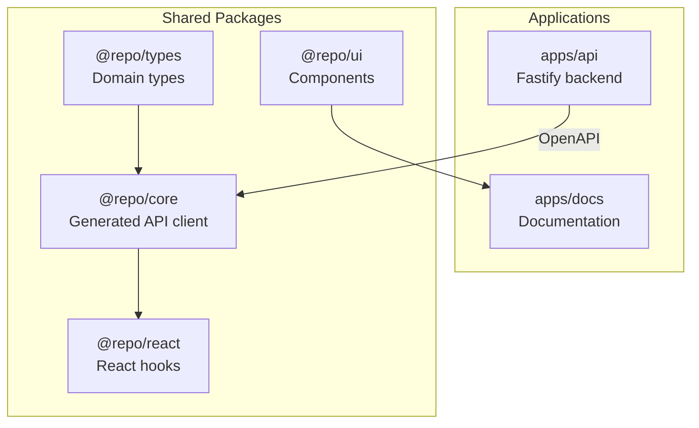

## Prerequisites

- Node.js >= 22
- pnpm 10.28.0
- (Optional) PostgreSQL or Supabase account

## Setup

### Install pnpm

If you don't have pnpm installed, install it using one of the following methods:

**Using npm:**
```bash
npm install -g pnpm@10.28.0
```

**Using corepack (recommended):**
```bash
corepack enable
corepack prepare pnpm@10.28.0 --activate
```

**Using standalone script:**
```bash
curl -fsSL https://get.pnpm.io/install.sh | sh -
```

Verify your installation:
```bash
pnpm --version
```

## Quick Start

### 1. Clone and Install (2 min)

```bash
git clone <repository-url>
cd <project-name>
pnpm install
```

### 2. Explore the Running Apps (3 min)

```bash
pnpm dev
```

- **API**: http://localhost:3001 (`GET /health`, `/reference` for docs)
- **Docs**: http://localhost:3002

### 3. Understand the Structure (5 min)

**Apps:** `apps/api/` (Fastify backend), `apps/docs/` (documentation)

**Packages:** `core/` (generated API client), `types/` (domain types), `react/` (React Query hooks), `ui/` (components)



### 4. Make Your First Change (5 min)

Add a new API endpoint: implement route → generate OpenAPI → use typed client. See [Add an API Endpoint](/docs/guides/add-endpoint) for details.

## Next Steps

**Understand Core Concepts:**
- [Monorepo Structure](/docs/monorepo) - Package organization
- [API Development](/docs/api-development) - REST API with OpenAPI and client generation
- [Portability Strategy](/docs/portability) - Avoiding vendor lock-in

**AI-Driven Development:**
- [AI Workflow](/docs/ai-workflow) - Recommended development workflow
- [Cursor Setup](/docs/cursor-setup) - Configure your IDE

**Add Features:**
- [How-To Guides](/docs/guides) - Common tasks
- [Architecture](/docs/architecture) - Deep technical details

## Environment Setup (Optional)

For database features, you'll need PostgreSQL. See [Environment Setup Guide](/docs/guides/environment-setup).