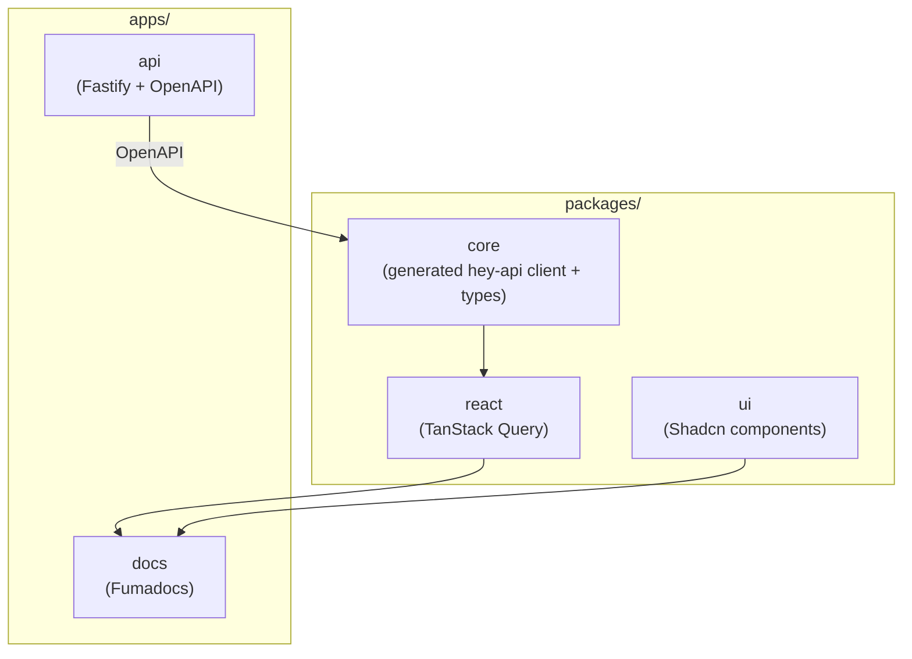

Monorepo architecture using **Turborepo** for orchestration. Designed for projects that need to:
- **Publish SDKs** - Generate multi-language SDKs from shared contracts
- **Develop multiple services** - Reuse software while maintaining separation
- **Maintain clear boundaries** - Strict dependency rules prevent coupling

## Overview

All applications and packages coexist in one repository with clear organizational boundaries:

- **`apps/`** - Applications (API, Docs, etc.)
- **`packages/`** - Shared packages (core, react, ui, etc.)
- **`devtools/`** - Shared development tooling (eslint, react, typescript configs)

## Why Monorepo?

- ✅ **Code reuse** - Shared components, types, and utilities
- ✅ **Unified tooling** - Consistent linting, formatting, build standards
- ✅ **Faster CI/CD** - Turborepo caching
- ✅ **Simplified dependencies** - Automatic synchronization
- ✅ **Better DX** - Single repository, consistent experience

## Package Dependency Graph



## Turborepo Benefits

Intelligent caching: task caching, parallel execution, remote caching, pipeline configuration.

## Package Organization

### Applications (`apps/`)

- `apps/api` - Fastify backend API
- `apps/docs` - Documentation site (Fumadocs)

### Shared Packages (`packages/`)

Packages follow strict dependency rules:

- **`core`** - Generated runtime-agnostic API client + types (via hey-api from OpenAPI)
- **`react`** - React-specific hooks and TanStack Query integration (generated via hey-api)
- **`ui`** - Shared UI components (Shadcn/ui based)

### Dependency Direction

Strict one-way dependencies prevent circular references:

```
apps/api (OpenAPI) → core → react
```

## Workspace Configuration

Uses **pnpm workspaces**: `workspace:*` protocol, symlink-based resolution, proper dependency hoisting.

## Development Workflow

1. Local development: Direct TypeScript imports (no build)
2. Package builds: `tsup` compiles to ESM
3. CI/CD: Turborepo orchestrates with caching
4. Publishing: `prepack` switches exports to `dist/`

## Related Documentation

- [Package Conventions](/docs/architecture/package-conventions) - Detailed package architecture
- [API Development](/docs/api-development) - REST API with OpenAPI and client generation
- [Monorepo Architecture](/docs/architecture/monorepo) - Architecture details
