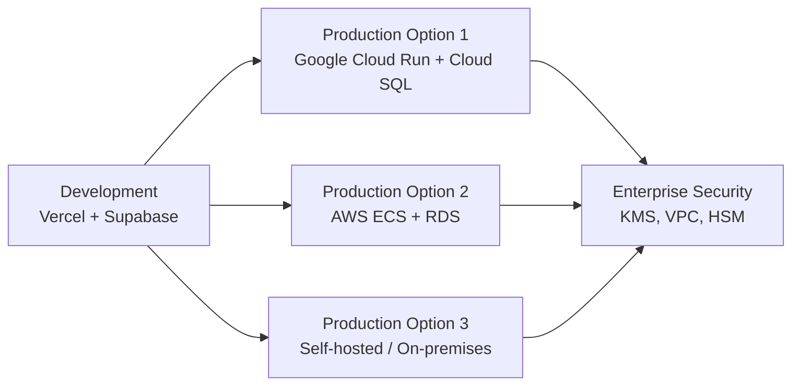

The stack uses standard technologies with no vendor lock-in, enabling migration between deployment platforms without code changes. Start with rapid iteration on Vercel + Supabase, then migrate to Google Cloud or AWS for production security when needed.

## Philosophy

**Start fast, scale secure:**

1. **Development** - Rapid iteration on Vercel + Supabase
2. **Production** - Migrate to Google Cloud / AWS for enterprise security
3. **Zero code changes** - Only configuration changes required

## Why Portability Matters

- ✅ **No vendor lock-in** - Standard technologies, no proprietary APIs
- ✅ **Security flexibility** - Migrate to environments with KMS, VPC, HSM
- ✅ **Cost optimization** - Choose best provider for each stage
- ✅ **Compliance** - Meet enterprise security requirements when needed

## Migration Paths

## Technology Choices for Portability

### Runtime: Node.js LTS

- ✅ **Standard Node.js** - Runs anywhere (Vercel, GCP, AWS, on-premises)
- ✅ **No platform-specific code** - Pure Node.js application
- ✅ **Universal support** - All cloud providers support Node.js

### Framework: Fastify

- ✅ **Standard HTTP** - No framework lock-in
- ✅ **Portable** - Runs as standard Node.js process
- ✅ **Migration** - Change deployment target only, no code changes

### Database: PostgreSQL + Drizzle

- ✅ **Standard SQL** - Works with any PostgreSQL host
- ✅ **Plain SQL queries** - Drizzle generates standard PostgreSQL
- ✅ **No proprietary APIs** - Standard `DATABASE_URL` connection
- ✅ **Migration** - Only requires changing `DATABASE_URL`

## Deployment Options

### Development: Vercel + Supabase

**Best for:** Rapid iteration, preview environments, fast setup

- **Vercel** - Serverless functions, edge network, preview deployments
- **Supabase** - Managed Postgres, branching, local development
- **Fast setup** - Get started in minutes

### Production: Google Cloud

**Best for:** Enterprise security, compliance, Google Cloud ecosystem

- **Cloud Run** - Serverless containers, auto-scaling
- **Cloud SQL** - Managed PostgreSQL with backups
- **Security** - KMS encryption, VPC isolation, Cloud IAM
- **Migration** - Change `DATABASE_URL`, deploy to Cloud Run

### Production: AWS

**Best for:** AWS ecosystem, enterprise compliance

- **ECS / EC2** - Container orchestration or VMs
- **RDS** - Managed PostgreSQL with backups
- **Security** - KMS encryption, VPC isolation, IAM
- **Migration** - Change `DATABASE_URL`, deploy to ECS/EC2

## Code Changes Required

**Answer: None!**

The entire stack uses standard technologies:

- ✅ **Fastify** - Standard Node.js, no platform-specific code
- ✅ **Drizzle** - Generates plain SQL, no proprietary runtime
- ✅ **PostgreSQL** - Standard SQL, works with any Postgres host
- ✅ **Environment variables** - Only `DATABASE_URL` needs to change

## Related Documentation

- [Backend Stack](/docs/architecture/backend-stack) - Technology choices
- [ADR 002: Backend Framework](/docs/adrs/002-backend-framework) - Portability rationale
- [ADR 007: Backend ORM](/docs/adrs/007-backend-orm) - Zero vendor lock-in
- [ADR 008: Database Platform](/docs/adrs/008-database) - Migration strategy
