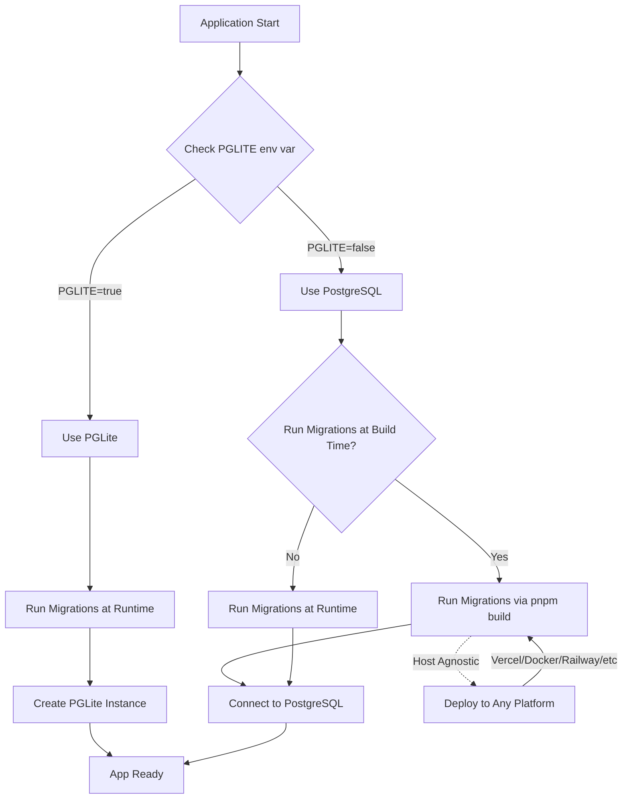

## Context

We need to select a database platform that must support:

- Strong transactional guarantees (ACID)
- Extensions for geospatial, vector search, and specialized metadata
- A clear path to enterprise security controls (HSMs, KMS, private networking)
- The ability to migrate to regulated cloud or on-premises environments
- Zero application-layer vendor lock-in
- Support for both development (rapid iteration) and production (security-focused) deployments
- Compatibility with our portability goals (Fastify + Drizzle stack)

## Considered Options

### Option A – PostgreSQL + Supabase (Initial) + Drizzle ORM (Chosen)

PostgreSQL database with Supabase as initial managed provider, using Drizzle ORM for abstraction.

**Pros**

- **Portability**: Standard SQL, works with any PostgreSQL host
- **ACID transactions**: Full support for transactional integrity
- **Initial setup**: Fast setup with Supabase for rapid iteration
- **Production ready**: Yes, suitable for production workloads
- **Enterprise support**: Available through Supabase and migration to cloud providers
- **Migration path**: Easy - only requires changing `DATABASE_URL`
- **Zero vendor lock-in**: Standard PostgreSQL, no proprietary APIs
- **Security flexibility**: Can migrate to environments with KMS, VPC, Cloud HSM
- **Supabase benefits**: Managed Postgres with backups, monitoring, branching for preview environments
- **Local development**: Supabase CLI for local development
- **Postgres extensions**: Support for PostGIS, vector, crypto, full-text search

**Cons**

- Slightly more setup than fully proprietary stacks
- Requires managing migrations and schema explicitly

### Option B – PostgreSQL + Cloud Managed (RDS/Cloud SQL)

PostgreSQL database with AWS RDS or Google Cloud SQL as managed provider.

**Pros**

- **Portability**: Standard SQL
- **ACID transactions**: Full support
- **Production ready**: Yes
- **Enterprise support**: Available
- **Migration path**: Change `DATABASE_URL`
- **Security controls**: Native KMS, VPC isolation, IAM/Cloud IAM

**Cons**

- **Initial setup**: More configuration required than Supabase
- Less rapid iteration for development (no branching, more setup)

### Option C – PostgreSQL + Self-hosted

Self-hosted PostgreSQL database.

**Pros**

- **Portability**: Standard SQL
- **ACID transactions**: Full support
- **Production ready**: Yes
- **Enterprise support**: Available
- **Full control**: Complete control over infrastructure

**Cons**

- **Initial setup**: Complex setup and maintenance
- Requires database administration expertise
- More operational overhead

### Option D – Embedded Database (PGlite)

PostgreSQL embedded in the runtime.

**Pros**

- **Initial setup**: Very fast
- **ACID transactions**: Full support
- Good for local development and testing

**Cons**

- **Production ready**: No - not suitable for production
- **Enterprise support**: Limited
- **Migration path**: Rewrite needed for production
- Not suitable for concurrent workloads or multi-instance deployments

### Option E – Other Databases (MongoDB, MySQL, etc.)

Alternative database engines.

**Pros**

- Some have good ecosystem support

**Cons**

- **Portability**: Vendor-specific, not standard SQL
- **ACID transactions**: Varies by database
- **Migration path**: Rewrite needed to switch
- Less compatible with our PostgreSQL-focused stack

## Decision

We will use **PostgreSQL** as the single database engine with **Supabase** as the initial managed Postgres provider, using **Drizzle ORM** as the database abstraction.

### TLDR: Comparison Table

| Feature | PostgreSQL + Supabase ✅ | Cloud Managed Postgres | Self-hosted Postgres | Embedded (PGlite) | Other Databases |
|---------|-------------------------|----------------------|---------------------|-------------------|-----------------|
| **Portability** | ✅ Standard SQL | ✅ Standard SQL | ✅ Standard SQL | ⚠️ Limited | ❌ Vendor-specific |
| **ACID transactions** | ✅ Full support | ✅ Full support | ✅ Full support | ✅ Full support | ⚠️ Varies |
| **Initial setup** | ✅ Fast | ⚠️ More config | ⚠️ Complex | ✅ Very fast | ⚠️ Varies |
| **Production ready** | ✅ Yes | ✅ Yes | ✅ Yes | ❌ No (dev/test only) | ⚠️ Depends |
| **Enterprise support** | ✅ Available | ✅ Available | ✅ Available | ❌ Limited | ⚠️ Varies |
| **Migration path** | ✅ Change DATABASE_URL | ✅ Change DATABASE_URL | ✅ Standard | ❌ Rewrite needed | ❌ Rewrite needed |

**Main reasons:**

- PostgreSQL provides ACID guarantees, mature extensions, and enterprise acceptance
- Supabase accelerates initial development with managed Postgres, branching, and local development
- Drizzle ORM ensures **zero vendor lock-in** by generating plain SQL with no proprietary runtime
- **Portability**: Migration requires only changing `DATABASE_URL` - no code changes
- **Clear migration path**: Supabase → AWS RDS / Google Cloud SQL → self-hosted / on-premises
- **Security flexibility**: Easy move to environments with KMS encryption, VPC isolation, Cloud HSM
- **No cold starts on infrastructure**: Can run with always-on database on Google Cloud or AWS
- **Complements Fastify**: Both chosen for portability and ability to migrate from Vercel to GCP/AWS

## Migration Strategy

Database migrations follow a host-agnostic strategy that works across all deployment platforms (Docker, Railway, Fly.io, Render, localhost, etc.).

### Migration Execution

**PostgreSQL (Production):**
- Migrations run at **build time** via `pnpm build` → `pnpm db:migrate` → `tsc`
- Migrations are **skipped at runtime** (already applied at build time)
- Faster startup (migrations already applied)
- Fails fast if migrations have issues
- Works with any deployment platform

**PGLite (Preview/Development):**
- Migrations skip at build time, run at **runtime** when instance is created
- PGLite instance doesn't exist at build time
- Migrations run during app initialization via `runMigrations()`

### Environment Configuration

The system uses a `PGLITE` environment variable to control database selection:

- **`PGLITE=true`**: Uses in-memory PGLite database (useful for preview branches, local dev without PostgreSQL)
- **`PGLITE=false`** (default): Uses PostgreSQL via `DATABASE_URL`
- When `PGLITE=true`, `DATABASE_URL` is optional and defaults to PGLite URL
- When `PGLITE=false`, `DATABASE_URL` is required

### Migration Flow

### Deployment Platform Examples

All platforms use the same build command pattern:

- **Docker**: `RUN pnpm build` (runs migrations)
- **Railway/Fly.io/Render**: `build: pnpm build` (runs migrations)
- **Local dev**: PostgreSQL migrations run at build time (via `pnpm dev` → `pnpm db:migrate`), PGLite migrations run at runtime

### Key Benefits

- **Host-agnostic**: No platform-specific code, standard npm scripts work everywhere
- **Build-time migrations**: PostgreSQL migrations run during build for faster startup, skipped at runtime
- **Runtime migrations**: PGLite migrations run when instance is created
- **Flexible**: Supports both PostgreSQL and PGLite based on environment configuration
- **Test-friendly**: Tests always use PGLite via `NODE_ENV=test`

## Notes

- **Strategic approach**: Start with Supabase for rapid iteration, migrate to Google Cloud/AWS for production security
- Supabase used as "Postgres as a service", not as platform dependency
- No Supabase SDKs, auth, storage, or proprietary APIs used - only standard PostgreSQL connection
- PGlite suitable for local dev/testing and preview branches, not production
- Migration path designed for: Development (Supabase) → Production (GCP Cloud SQL / AWS RDS)
- Both Fastify and Drizzle chosen specifically to avoid vendor lock-in and enable this migration
- **Security & Enterprise Portability**: Architecture allows migration to:
  - **AWS**: RDS/Aurora PostgreSQL, KMS encryption, VPC isolation, IAM-based access control
  - **Google Cloud**: Cloud SQL, CMEK/Cloud KMS, VPC-SC, Private Service Connect
  - **Private/On-prem**: Self-hosted Postgres, Hardware Security Modules, air-gapped environments
- Because SQL is portable, migrations are explicit, no vendor SDKs are used, and no platform-coupled APIs exist

## Related Documentation

- [Backend Stack](/docs/architecture/backend-stack) - PostgreSQL and Drizzle ORM integration patterns
- [ADR 007: Backend ORM](/docs/adrs/007-backend-orm) - Drizzle ORM selection decision
- [Portability Strategy](/docs/architecture/portability) - Database migration paths and portability strategy
- [Installation](/docs/getting-started/installation) - Database configuration and connection setup
