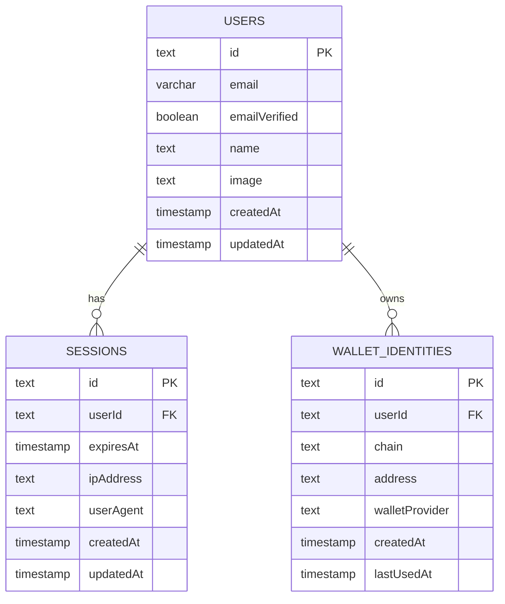

## Overview

The authentication system uses Better Auth as the core framework, integrated with Fastify and Drizzle ORM. It supports multiple authentication methods including email/password, magic links, and Web3 wallet authentication (SIWE for Ethereum and SIWS for Solana).

## Architecture Principles

- **Backend-controlled**: All authentication flows are verified server-side
- **Session-based**: Cookie-based sessions for web clients, JWTs optional for non-browser clients
- **Drizzle as source of truth**: All schema and migrations controlled by Drizzle ORM
- **Portable**: Works with PostgreSQL (production) or PGLite (testing/preview)
- **No vendor lock-in**: Self-hosted, no SaaS dependencies

## Authentication Methods

### Email & Password

Users can sign up and sign in using email and password. Email verification is required before accounts are fully activated.

**Endpoints:**
- `POST /api/auth/sign-up/email` - Register new user
- `POST /api/auth/sign-in/email` - Sign in with email/password

### Magic Link

Passwordless authentication via email links. Users receive a magic link that signs them in when clicked.

**Endpoints:**
- `POST /api/auth/sign-in/magic-link` - Send magic link to email
- `GET /api/auth/magic-link/verify` - Verify magic link token

### Web3 Wallet Authentication

Support for Ethereum (SIWE) and Solana (SIWS) wallet authentication. Users sign a message with their wallet to authenticate.

**Endpoints:**
- `GET /api/auth/sign-in/web3/:chain/nonce` - Get nonce for signing
- `POST /api/auth/sign-in/web3/:chain/verify` - Verify signature and create session

**Supported chains:**
- `eip155` - Ethereum and EVM-compatible chains
- `solana` - Solana blockchain

## Session Management

Sessions are stored in PostgreSQL and managed by Better Auth. Session cookies are:
- HttpOnly (not accessible via JavaScript)
- Secure in production (HTTPS only)
- SameSite: lax (CSRF protection)
- 7-day expiration with 1-day update age

## Data Model

### Users Table

```typescript
{
  id: string (primary key)
  email: string (unique, optional)
  emailVerified: boolean
  name: string (optional)
  image: string (optional)
  createdAt: timestamp
  updatedAt: timestamp
}
```

### Sessions Table

```typescript
{
  id: string (primary key)
  userId: string (foreign key → users.id)
  expiresAt: timestamp
  ipAddress: string (optional)
  userAgent: string (optional)
  createdAt: timestamp
  updatedAt: timestamp
}
```

### Wallet Identities Table

```typescript
{
  id: string (primary key)
  userId: string (foreign key → users.id)
  chain: 'eip155' | 'solana'
  address: string (normalized)
  walletProvider: string (optional)
  createdAt: timestamp
  lastUsedAt: timestamp
}
```

**Constraints:**
- Unique constraint on `(chain, address)`
- Indexes on `userId` and `address`

## Authentication Flow Diagrams

### High-Level Web3 Auth Flow


### Data Relationships



## Security Considerations

- **HTTPS only** in production
- **Strict domain validation** in SIWE/SIWS messages
- **Short-lived nonces** (5-minute TTL)
- **Rate limiting** on auth endpoints
- **Replay protection** via nonce validation
- **Explicit wallet linking/unlinking** (no silent merging)
- **Environment variable validation** via Zod schemas
- **Trust proxy configuration** for proper IP detection

## Wallet Management

Users can link and unlink wallets from their accounts:

- `GET /wallets` - List user's linked wallets (requires authentication)
- `DELETE /wallets/:chain/:address` - Unlink a wallet (requires authentication)

Wallets are never auto-merged. If a wallet is already linked to another account, explicit confirmation is required.

## Migration Strategy

The system uses a **host-agnostic migration strategy**:

- **PostgreSQL (Production)**: Migrations run at build time via `pnpm build` → `pnpm db:migrate` → `tsc`
- **PGLite (Preview/Testing)**: Migrations run at runtime when the instance is created

This ensures migrations work across all deployment platforms (Docker, Railway, Fly.io, Render, etc.).

## Implementation Status

**Implemented:**
- Better Auth foundation with Drizzle adapter
- Sessions table and management
- Email/password authentication
- Magic link authentication (basic)
- Web3 auth plugin structure (nonce generation)
- Wallet identities table
- Wallet management routes

**To Be Completed:**
- Full SIWE signature verification
- Full SIWS signature verification
- Nonce storage and validation
- User resolution logic for Web3 auth
- Magic link token storage and verification

## References

- [Better Auth Documentation](https://better-auth.dev)
- [Drizzle ORM Documentation](https://orm.drizzle.team)
- [SIWE Specification](https://docs.login.xyz)
- [Fastify Documentation](https://fastify.dev)
