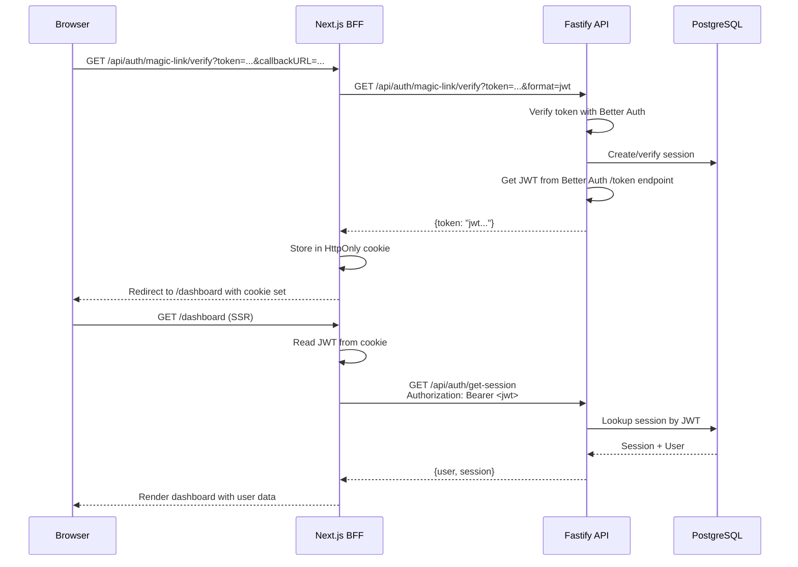
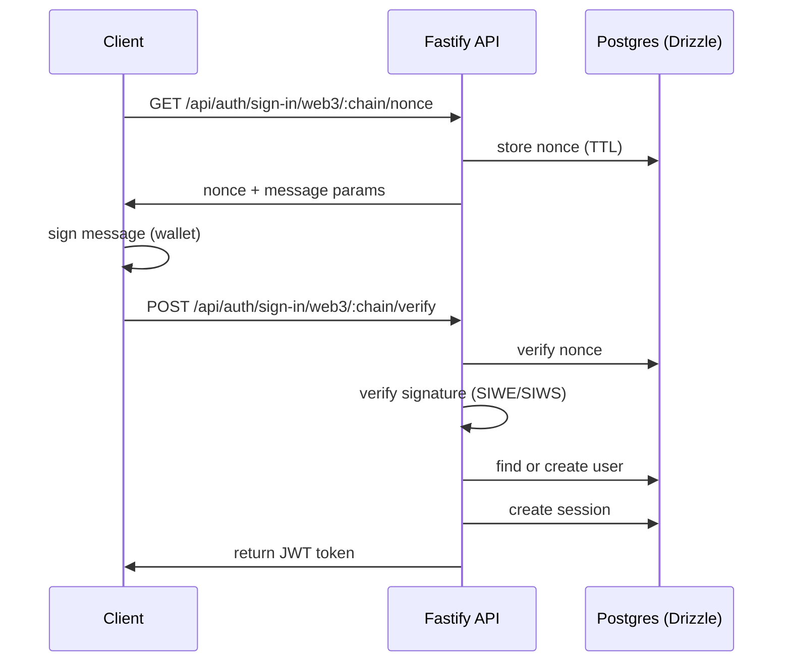
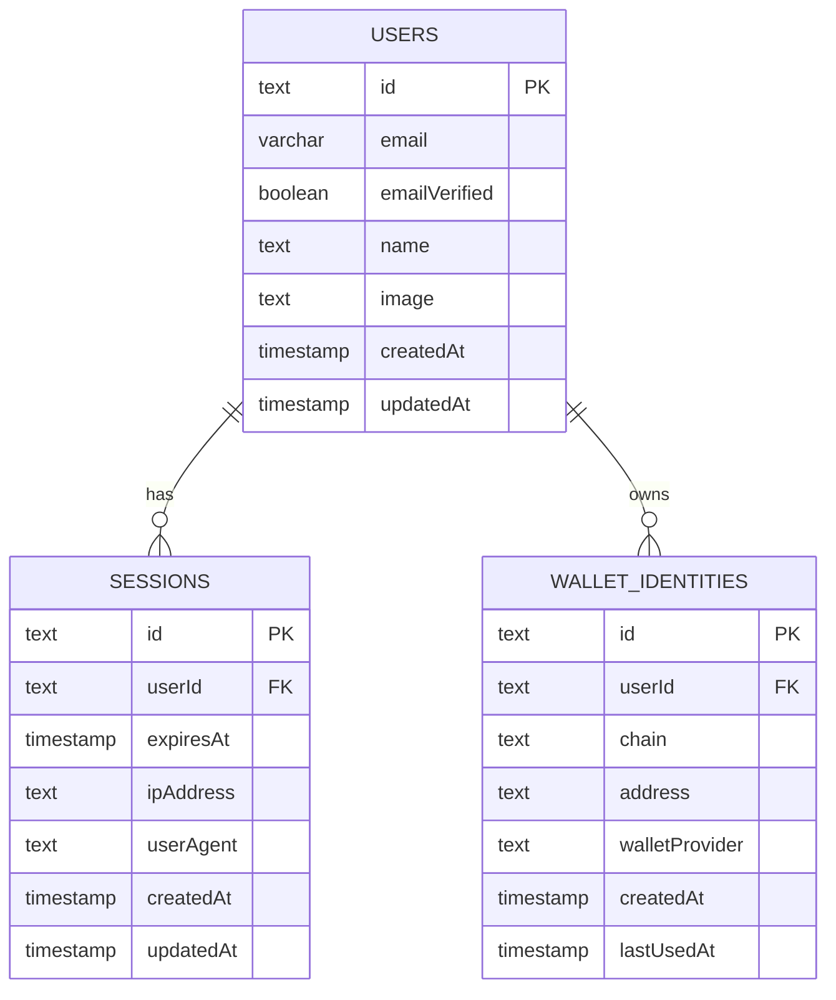

## Overview

The authentication system uses Better Auth as the core framework, integrated with Fastify and Drizzle ORM. It supports magic link authentication (passwordless email-based login) and is prepared for OAuth providers. Web3 wallet authentication infrastructure exists but is currently disabled.

## Architecture Principles

- **Backend-controlled**: All authentication flows are verified server-side
- **JWT-only**: Fastify accepts only `Authorization: Bearer` tokens
- **BFF pattern**: Next.js stores JWTs in HttpOnly cookies and proxies auth requests
- **Drizzle as source of truth**: All schema and migrations controlled by Drizzle ORM
- **Portable**: Works with PostgreSQL (production) or PGLite (testing/preview)
- **No vendor lock-in**: Self-hosted, no SaaS dependencies

## Authentication Methods

### Magic Link (Primary Method)

Passwordless authentication via email links. Users receive a magic link that signs them in when clicked.

**Endpoints:**
- `POST /api/auth/sign-in/magic-link` - Send magic link to email
  - Request body: `{ email: string, callbackURL?: string }`
  - Response: `{ status: true }`
  - Sends email with verification link containing a token
  
- `GET /api/auth/magic-link/verify?token=xxx&format=jwt` - Verify magic link token and return JWT
  - Query params: `token` (required), `format=jwt` (required for JWT response)
  - Response: `{ token: "jwt..." }` (JWT token in response body, no cookies set)
  - Used by Next.js BFF to fetch JWT for HttpOnly cookie storage
  
**JWT-Only Flow:**
- All magic link verifications with `format=jwt` return JWT in response body
- No session cookies are set when `format=jwt` is used
- Clients must store JWT and send as `Authorization: Bearer <token>`
- Web clients should use the Next.js BFF for HttpOnly cookie storage

### Web3 Wallet Authentication

Web3 wallet authentication infrastructure exists but is currently disabled. The plugin structure is in place for future implementation of Ethereum (SIWE) and Solana (SIWS) wallet authentication.

**Status:** Infrastructure ready, implementation pending

**Endpoints (when enabled):**
- `GET /api/auth/sign-in/web3/:chain/nonce` - Get nonce for signing
- `POST /api/auth/sign-in/web3/:chain/verify` - Verify signature and create session

**Supported chains (when enabled):**
- `eip155` - Ethereum and EVM-compatible chains
- `solana` - Solana blockchain

## Session Management

Sessions are stored in PostgreSQL and managed by Better Auth with JWT-based access:

**JWT Token Flow:**
- Magic link verification with `format=jwt` returns a JWT token in the response body
- Next.js BFF stores JWT in an HttpOnly cookie (client cannot access)
- All subsequent API requests include `Authorization: Bearer <token>` header
- Fastify validates bearer tokens by looking up sessions in the database
- JWT expiration configured via `JWT_EXPIRES_IN` environment variable

**Session Lookup:**
- Fastify's bearer plugin converts Authorization headers to session tokens
- Auth middleware queries the database to resolve JWT tokens to active sessions
- Protected routes access `request.session` populated by auth middleware

## Next.js BFF Pattern

The Next.js app acts as a Backend-for-Frontend, proxying auth requests and managing JWT storage:

**Request Flow:**
1. **Magic link verify**: Next.js receives `/api/auth/magic-link/verify?token=xxx&format=jwt`
2. **JWT fetch**: BFF requests JWT from Fastify: `GET /api/auth/magic-link/verify?token=xxx&format=jwt`
3. **Token storage**: Fastify returns `{token: "jwt..."}`, BFF stores in HttpOnly cookie
4. **Redirect**: BFF redirects to dashboard with cookie set
5. **SSR/API requests**: BFF reads cookie server-side and injects `Authorization: Bearer` header
6. **Sign out**: BFF clears HttpOnly cookie and proxies sign-out to Fastify

**Security Benefits:**
- JWT never exposed to client JavaScript (HttpOnly cookie)
- BFF handles token refresh and rotation server-side
- Client code doesn't manage authentication state
- Server Components get authenticated requests automatically

## Data Model

### Users Table

```typescript
{
  id: string (primary key)
  email: string (unique, optional)
  emailVerified: boolean
  name: string (optional)
  image: string (optional)
  createdAt: timestamp
  updatedAt: timestamp
}
```

### Sessions Table

```typescript
{
  id: string (primary key)
  userId: string (foreign key → users.id)
  expiresAt: timestamp
  ipAddress: string (optional)
  userAgent: string (optional)
  createdAt: timestamp
  updatedAt: timestamp
}
```

### Verification Table

```typescript
{
  id: string (primary key)
  identifier: string (email address)
  value: string (token)
  expiresAt: timestamp
  createdAt: timestamp
  updatedAt: timestamp
}
```

**Purpose:** Stores magic link tokens for email authentication

**Constraints:**
- Indexes on `identifier` and `expiresAt` for performance

### Account Table

```typescript
{
  id: string (primary key)
  userId: string (foreign key → users.id)
  accountId: string
  providerId: string (OAuth provider)
  accessToken: string (optional)
  refreshToken: string (optional)
  idToken: string (optional)
  accessTokenExpiresAt: timestamp (optional)
  refreshTokenExpiresAt: timestamp (optional)
  scope: string (optional)
  createdAt: timestamp
  updatedAt: timestamp
}
```

**Purpose:** Stores OAuth provider accounts (ready for future OAuth implementation)

**Note:** No password field - magic link authentication only

**Constraints:**
- Foreign key to `users` with cascade delete
- Indexes on `userId` and `accountId`

### Wallet Identities Table

```typescript
{
  id: string (primary key)
  userId: string (foreign key → users.id)
  chain: 'eip155' | 'solana'
  address: string (normalized)
  walletProvider: string (optional)
  createdAt: timestamp
  lastUsedAt: timestamp
}
```

**Purpose:** Stores Web3 wallet identities (infrastructure ready, implementation pending)

**Constraints:**
- Unique constraint on `(chain, address)`
- Indexes on `userId` and `address`

## Technical Implementation

### Fastify Auth Middleware

The auth plugin (`apps/fastify/src/plugins/auth.ts`) implements JWT-only authentication:

1. **Bearer Token Extraction**: Extracts JWT from `Authorization: Bearer <token>` header
2. **Better Auth Bearer Plugin**: Enables bearer token support in Better Auth framework
3. **Session Lookup**: Queries database to resolve JWT to active session via `getSessionFromToken` helper
4. **Request Context**: Populates `request.session` for protected route access

**Protected Routes:**
- Use `requireAuth(request)` helper to enforce authentication
- Returns typed session with `user` and `session` objects
- Automatically throws 401 if not authenticated

**Session Lookup (`apps/fastify/src/lib/auth-session.ts`):**
- Calls Better Auth's `auth.handler` with bearer token
- Resolves JWT to session by querying database
- Caches session in `request.session` for route handlers

### Magic Link JWT Proxy

The auth proxy (`apps/fastify/src/lib/auth-proxy.ts`) handles JWT-formatted responses:

**When `format=jwt` is present:**
1. Calls Better Auth verification endpoint (without `format` param)
2. Better Auth verifies token and creates session
3. Extracts session cookie from Better Auth response
4. Calls `/api/auth/token` endpoint with session cookie
5. Returns JWT token in response body: `{ token: "jwt..." }`
6. Never sets cookies in response to client

**Implementation Strategy:**
- Isolates Better Auth's internal session cookies from clients
- Converts session-cookie-based flow to JWT-only for external consumption
- Ensures `format=jwt` requests are truly stateless (no cookies required or sent)

### Next.js BFF Proxy

The Next.js BFF (`apps/next/app/api/auth/[...path]/route.ts`) provides secure JWT storage:

**Magic Link Verification:**
1. Intercepts `/api/auth/magic-link/verify` requests
2. Adds `format=jwt` parameter when proxying to Fastify
3. Receives JWT in response body
4. Stores JWT in HttpOnly cookie (`better-auth.jwt_token`)
5. Redirects to callback URL with cookie set

**General Auth Proxying:**
- Reads JWT from HttpOnly cookie server-side
- Injects `Authorization: Bearer` header in proxied requests
- Strips all cookies from proxied requests (JWT-only to Fastify)
- Returns responses without cookie headers

## Authentication Flow Diagrams

### Magic Link Web Flow



### High-Level Web3 Auth Flow



### Data Relationships



## Security Considerations

- **HTTPS only** in production
- **JWT-only authentication** - No session cookies accepted by Fastify
- **HttpOnly cookie storage** - JWT stored in HttpOnly cookie by Next.js BFF (prevents XSS)
- **Bearer token validation** - All API requests validated via Authorization header
- **Database session lookup** - JWT tokens resolved to active sessions via database queries
- **Strict domain validation** in SIWE/SIWS messages
- **Short-lived nonces** (5-minute TTL)
- **Rate limiting** on auth endpoints
- **Replay protection** via nonce validation
- **Explicit wallet linking/unlinking** (no silent merging)
- **Environment variable validation** via Zod schemas
- **Trust proxy configuration** for proper IP detection

## Wallet Management

Users can link and unlink wallets from their accounts:

- `GET /wallets` - List user's linked wallets (requires authentication)
- `DELETE /wallets/:chain/:address` - Unlink a wallet (requires authentication)

Wallets are never auto-merged. If a wallet is already linked to another account, explicit confirmation is required.

## Migration Strategy

The system uses a **host-agnostic migration strategy**:

- **PostgreSQL (Production)**: Migrations run at build time via `pnpm build` → `pnpm db:migrate` → `tsc`
- **PGLite (Preview/Testing)**: Migrations run at runtime when the instance is created

This ensures migrations work across all deployment platforms (Docker, Railway, Fly.io, Render, etc.).

## Implementation Status

**Implemented:**
- Better Auth foundation with Drizzle adapter and bearer plugin
- JWT-only authentication flow (no cookie-based auth)
- Magic link authentication with JWT token response (`format=jwt`)
- Next.js BFF with HttpOnly cookie storage for web clients
- Database-backed session lookup for bearer tokens
- Sessions table and management
- Verification table for magic link tokens
- Account table (OAuth ready, no password field)
- Error handling with `@repo/error/node`
- Auth proxy for JWT conversion from Better Auth sessions
- Web3 auth plugin structure (infrastructure only)
- Wallet identities table (infrastructure only)

**Architecture Decisions:**
- **JWT-only**: Fastify accepts only `Authorization: Bearer` tokens, no session cookies
- **BFF pattern**: Next.js stores JWTs in HttpOnly cookies and injects bearer headers
- **Magic link only**: Password authentication removed in favor of passwordless email-based login
- **OAuth ready**: Account table prepared for future OAuth provider integration
- **Web3 disabled**: Infrastructure exists but tests are disabled until full implementation

**To Be Completed:**
- OAuth provider integration (Google, GitHub, etc.)
- Full SIWE signature verification
- Full SIWS signature verification
- Nonce storage and validation for Web3 auth
- User resolution logic for Web3 auth

## References

- [Better Auth Documentation](https://better-auth.dev)
- [Drizzle ORM Documentation](https://orm.drizzle.team)
- [SIWE Specification](https://docs.login.xyz)
- [Fastify Documentation](https://fastify.dev)
