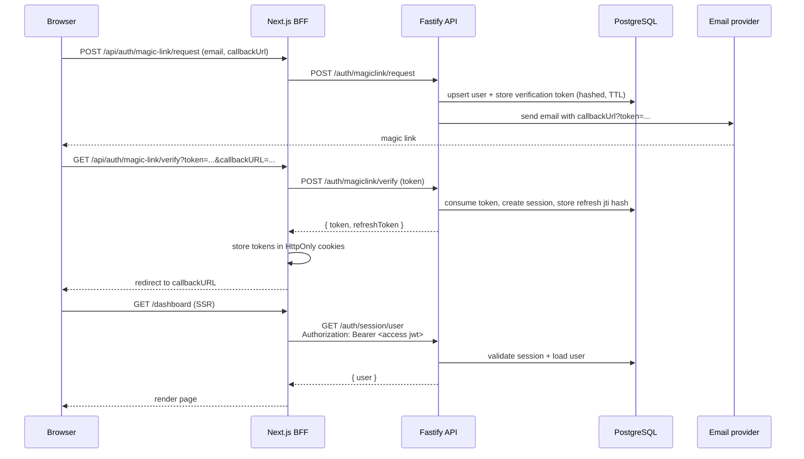

## Overview

Authentication is implemented in `apps/fastify` as a **JWT Bearer** system backed by **Drizzle + PostgreSQL/PGLite** session state.

We use JWTs to support **all client types** (web, mobile, desktop, servers, CLIs) with a single, standard `Authorization: Bearer` integration.

It supports:

- **Magic link**: passwordless email sign-in
- **OAuth**: sign in with providers
- **Web3**: sign in with wallets

## Principles

- **Backend-controlled**: authentication is verified server-side
- **JWT Bearer**: the API accepts `Authorization: Bearer <accessToken>`
- **Access + refresh tokens**: short-lived access JWTs, rotated refresh JWTs
- **DB-backed sessions**: tokens reference a session id that can be revoked
- **BFF for browsers**: Next.js stores tokens in HttpOnly cookies and proxies auth requests

## Authentication methods

### Magic link (implemented)

Magic link sign-in issues a **single-use token** over email, then exchanges it for JWTs.

### OAuth

OAuth sign-in uses provider authorization + callback flows and issues access + refresh JWTs. Provider accounts are stored in `account` (provider id, account id, and encrypted tokens at rest).

### Web3

Web3 sign-in follows a nonce → sign → verify flow (SIWE/SIWS-style) and returns access + refresh JWTs:

## Tokens & sessions

### Access token (JWT)

- **Type**: `typ = "access"`
- **Claims**: `sub` (user id), `sid` (session id), `iss`, `aud`
- **Lifetime**: `ACCESS_JWT_EXPIRES_IN_SECONDS`
- **Validation**: Fastify verifies the JWT, then loads the session + user from DB and attaches `request.session`

### Refresh token (JWT)

- **Type**: `typ = "refresh"`
- **Claims**: `sub` (user id), `sid` (session id), `jti` (refresh token id), `iss`, `aud`
- **Lifetime**: `REFRESH_JWT_EXPIRES_IN_SECONDS`
- **Rotation**: `POST /auth/session/refresh` returns a new access+refresh pair

Refresh token reuse is detected by hashing the `jti` and comparing it to the stored session token hash. On reuse, the session is revoked.

### Session lifecycle

- **Create**: magic link verification creates a session and stores a hash of the refresh `jti`
- **Refresh**: refresh rotates `jti` and extends session expiry
- **Revoke**: logout deletes the session (and refresh reuse detection revokes)

## Endpoints

All endpoints below are served by `apps/fastify`. The API does not set cookies; tokens are returned as JSON.

- **Magic link**
  - `POST /auth/magiclink/request` → `{ ok }`
  - `POST /auth/magiclink/verify` → `{ token, refreshToken }`
- **OAuth**
  - `GET /auth/oauth/:provider/authorize`
  - `GET /auth/oauth/:provider/callback` → `{ token, refreshToken }`
- **Web3**
  - `GET /auth/web3/:chain/nonce`
  - `POST /auth/web3/:chain/verify` → `{ token, refreshToken }`
  - `:chain` is `eip155` or `solana`
- **Session**
  - `GET /auth/session/user` (Bearer) → `{ user }`
  - `POST /auth/session/logout` (Bearer) → `204`
  - `POST /auth/session/refresh` → `{ token, refreshToken }`

## Next.js BFF (web)

For browser clients, `apps/next` acts as a **BFF (Backend-for-Frontend)**: a small backend layer tailored to the web app that proxies requests to the API and manages browser-specific concerns (like secure cookie storage).

- **Storage**: sets HttpOnly cookies `better-auth.jwt_token` (access) and `better-auth.refresh_token` (refresh)
- **Proxying**: `GET/POST /api/auth/*` is translated to Fastify `/auth/*` (for example `magic-link` → `magiclink`)
- **SSR**: Server Components and server-side calls can read cookies and inject `Authorization: Bearer`
- **Refresh**: middleware renews expired access tokens via `POST /auth/session/refresh`

## Magic link flow (web)

The email link typically points to the Next.js BFF, which exchanges the token for JWTs and stores them in HttpOnly cookies.

## Data model (Drizzle)

The auth system relies on these tables:

- **`users`**: user identity (email-based for magic link)
- **`verification`**: single-use magic link tokens (stored hashed, with TTL)
- **`sessions`**: server-side session state (stores hashed refresh `jti`, plus expiry)
- **`account`**: OAuth provider accounts (provider id + encrypted tokens at rest)
- **`wallet_identities`**: Web3 identities (`eip155`/`solana` + normalized address)

## Security notes

- **Refresh token rotation**: refresh `jti` is rotated on every refresh; reuse revokes the session
- **Hashed secrets at rest**: magic link tokens and refresh `jti` are stored hashed
- **Callback URL safety**: `callbackUrl` is validated and can be restricted via `MAGIC_LINK_CALLBACK_HOST_ALLOWLIST`
- **OAuth tokens encrypted at rest**: provider access/refresh tokens are stored encrypted (AES-256-GCM)
- **Nonce-based Web3 verification**: nonces are short-lived and prevent replay attacks
- **Environment validation**: auth/security env vars are validated via Zod (`@t3-oss/env-core`)
