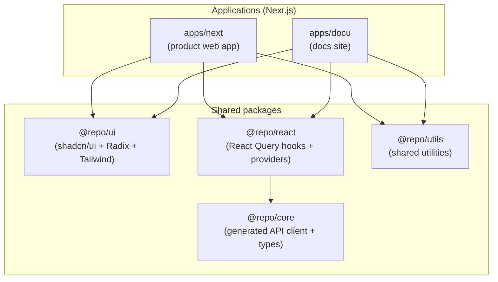

Frontend apps (for example `apps/next` and `apps/docu`) are built on **Next.js** and share UI, data access, and utilities through monorepo packages.

## Architecture at a glance



## Ownership & placement

Use these rules of thumb to keep code consistent across apps:

- Put **reusable UI primitives** in `@repo/ui`.
- Keep **app-only UI** in the app’s `components/`.
- Keep **domain + API consumption** in `@repo/core` / `@repo/react` (generated + wrappers), not hand-rolled per app.

## Rendering model (RSC-first)

Default to **Server Components**. Use Client Components only when you need:

- interactivity (`onClick`, forms)
- browser APIs (`window`, `localStorage`)
- client-only libraries

This keeps the default path simple: server rendering, smaller client bundles, and fewer hydration boundaries.

## Data layer (type-safe by default)

We keep data access consistent across apps:

- **Server Components**: fetch server-side when possible.
- **Client async state**: use **TanStack Query** (via `@tanstack/react-query`), preferably through generated hooks from `@repo/react`.
- **API client surface**: use `@repo/core` (runtime-agnostic) and `@repo/react` (React integration).

The generation pipeline is documented in [API Architecture](/docs/architecture/api) and [OpenAPI Generation](/docs/development/openapi-generation).

## UI system & styling

The shared design system lives in `@repo/ui`:

- **Components**: shadcn/ui-style components that we own and can edit
- **Accessibility primitives**: Radix UI under the hood
- **Styling**: Tailwind CSS, mobile-first
- **Consumption**: apps import from `@repo/ui/components/*`

## v0-assisted UI workflow

We use **v0** (Vercel’s UI generator) for rapid prototyping because it outputs **Next.js + shadcn/ui**-compatible components we can commit and maintain.

Workflow:

1. Prototype UI in v0
2. Install/author components in `@repo/ui`
3. Customize for product needs (variants, tokens, composition)
4. Consume from apps via `@repo/ui/components/*`

## Core libraries & patterns

### Data fetching & async state

- **`@tanstack/react-query`**: default choice for async data and server state (caching, dedupe, retries)
- **`@repo/react`**: generated React Query hooks and integration for the OpenAPI client surface
- **`@repo/core`**: generated, runtime-agnostic API client and types
- **`@lukemorales/query-key-factory`**: centralized query key factories (for hand-written queries)

### URL and local state

- **`nuqs`**: URL-based state for shareable UI state (filters, search, tabs, pagination)
- **`ahooks`**: `useSetState` for grouped ephemeral state, `useLocalStorageState` for persistence

### Validation, errors, utilities

- **`zod`**: schema validation at boundaries (prefer `z.infer<typeof schema>`)
- **`react-error-boundary`**: component subtree failure isolation (see error handling below)
- **`@repo/utils`**: shared utilities (prefer subpath imports)
- **`lodash-es`**: per-function imports for common operations
- **`nanoid`**: unique IDs when needed

### Web3 (when applicable)

- **`viem`**: low-level Ethereum interactions
- **`wagmi`**: React hooks for Ethereum (built on viem + TanStack Query)

### Query key factory (example)

```tsx
import { createQueryKeys } from "@lukemorales/query-key-factory"

export const users = createQueryKeys("users", {
  detail: (id: string) => ({
    queryKey: [id],
    queryFn: () => fetchUser(id),
  }),
})
```

### nuqs URL state (example)

```tsx
import { parseAsInteger, parseAsString, useQueryStates } from "nuqs"

const [filters, setFilters] = useQueryStates({
  search: parseAsString.withDefault(""),
  page: parseAsInteger.withDefault(1),
})
```

## Error handling

Use `react-error-boundary` for component subtree failures and prefer shared error utilities from `@repo/*` packages.

See [Error Handling](/docs/architecture/error-handling) for project-wide patterns.

## Performance & concurrency

Next.js uses modern React rendering features by default. Practical guidance:

- **Stream on the server** with layouts and `loading.tsx` boundaries.
- **Use Suspense** to isolate slow client boundaries instead of blocking whole pages.
- **Mark non-urgent updates** (search, filters, heavy re-render paths) as transitions when needed.

## Testing & quality

Frontend tests live at the app level (component tests, integration, E2E). See [Frontend Testing](/docs/testing/frontend-testing) for canonical patterns (including when mocks are allowed).

