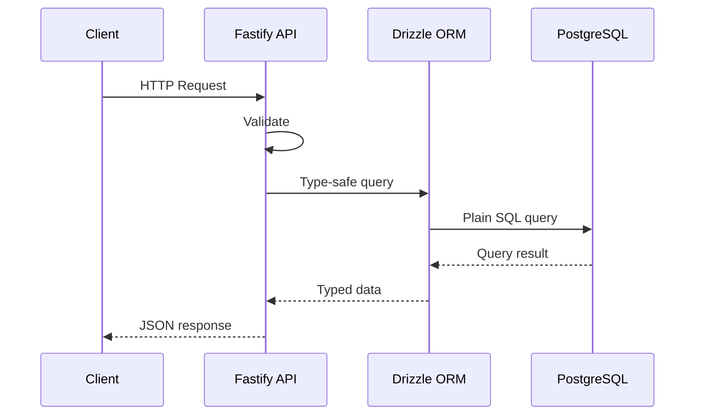

The architecture is guided by these principles:

- Composability and reusability
- Security and automation
- Designed for scale
- API as source of truth
- Multiple clients (web, mobile, desktop, other servers)
- No vendor lock-in
- Tooling chosen for long-term and community support

## Architecture Flow

## Architecture Topics

- **[Monorepo Structure](/docs/architecture/monorepo)** - Turborepo organization and package architecture
- **[API Architecture](/docs/architecture/api)** - Node.js, Fastify, PostgreSQL, Drizzle ORM
- **[Authentication](/docs/architecture/authentication)** - Magic link, OAuth and Web3 wallet authentication
- **[Frontend Architecture](/docs/architecture/frontend)** - Next.js, Shadcn/ui, Tailwind CSS
- **[ESM & TypeScript Strategy](/docs/architecture/esm-strategy)** - ESM module system architecture and TypeScript configuration
- **[Error Handling](/docs/architecture/error-handling)** - Error handling and logging 
- **[Portability Strategy](/docs/architecture/portability)** - Zero vendor lock-in strategy
