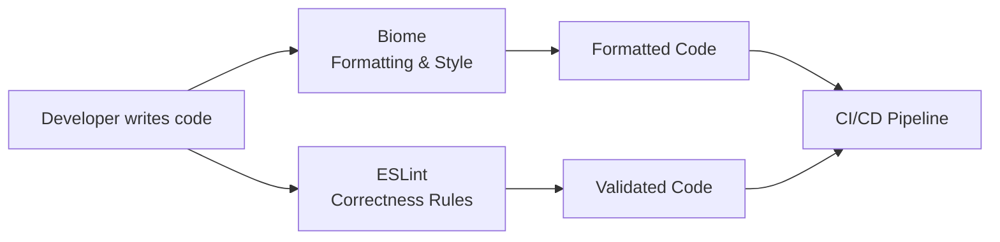

## Overview

We use **pnpm** for package management and a **hybrid Biome + ESLint** setup. Biome handles fast formatting and stylistic rules, while ESLint focuses on correctness rules for TypeScript, React, and Next.js.

## Package Manager: pnpm

**pnpm** is our package manager of choice for monorepo reliability:

- ✅ **Workspace support** - Correctly hoists and resolves dependencies across workspace packages
- ✅ **Monorepo maturity** - Battle-tested with Next.js, Fastify, and Turborepo
- ✅ **Symlink-based** - Proper node_modules structure for workspace packages
- ✅ **Production stability** - Reliable builds without workarounds
- ✅ **Consistent behavior** - Same behavior in development and production

### Why pnpm over alternatives?

- **vs npm/yarn** - Better workspace dependency resolution
- **vs Bun** - More mature monorepo support and production stability

## Linting & Formatting: Hybrid Biome + ESLint

We use a **hybrid approach** that combines the best of both tools:

- **Biome** - Fast formatting and stylistic rules (Rust-based)
- **ESLint** - Correctness rules for TypeScript, React, Next.js

### Clear Separation of Concerns



### Biome Responsibilities

**Biome** handles (extremely fast, Rust-based):

- ✅ **Code formatting** - All formatting concerns (faster than Prettier)
- ✅ **Stylistic linting** - Import sorting, unused variables, style preferences
- ✅ **Pre-commit hooks** - Auto-formatting of staged files

### ESLint Responsibilities

**ESLint** handles (focused on correctness):

- ✅ **TypeScript rules** - Type safety and correctness
- ✅ **React rules** - React and React Hooks best practices
- ✅ **Next.js rules** - Framework-specific rules via `@next/eslint-plugin-next`
- ✅ **Fastify rules** - Backend code quality

### Workflow

```bash
# Format code (extremely fast)
pnpm lint:biome:fix

# Lint with Biome (formatting and stylistic checks)
pnpm lint:biome

# Lint with ESLint (correctness checks)
pnpm lint:eslint

# Fix all (runs both Biome and ESLint fixes)
pnpm lint:fix
```

### Pre-commit & CI/CD

- **Pre-commit hooks** - Biome auto-formats staged files
- **CI/CD** - Both tools run for quality assurance
- **Fast feedback** - Minimal waiting time, excellent developer experience

## Why Hybrid Approach?

### Maximum Speed

- **Biome** is written in Rust, providing extremely fast formatting
- **ESLint** focuses only on correctness (faster execution without formatting)

### Best of Both Worlds

- **Biome's speed** for formatting and stylistic checks
- **ESLint's mature ecosystem** for framework-specific rules

### Clear Boundaries

- **Biome** = formatting/stylistic
- **ESLint** = correctness
- No conflicts, no confusion

## Configuration

### Biome Configuration

Biome handles all formatting and basic linting:

```json
{
  "$schema": "https://biomejs.dev/schemas/1.9.4/schema.json",
  "formatter": {
    "enabled": true
  },
  "linter": {
    "enabled": true
  }
}
```

### ESLint Configuration

ESLint configured to disable checks Biome handles:

- Uses ESLint 9 flat config format
- Focused on TypeScript, React, Next.js, Fastify rules
- No formatting rules (Biome handles those)

## Turborepo Task Orchestration

**Turborepo** orchestrates builds, tests, and other tasks across the monorepo:

### Task Configuration

Tasks are configured in `turbo.json` with:
- **Dependencies** - Task execution order (`dependsOn`)
- **Outputs** - Build artifacts for caching (`.next/**`, `dist/**`, `.react-email/**`)
- **Environment variables** - Required env vars for each task
- **Caching** - Intelligent caching based on inputs and outputs

### Development Workflow

**`pnpm dev`** - Starts all development servers with watch mode:

- **`@repo/core`** - Watches OpenAPI spec and regenerates API client
- **`@repo/react`** - Watches OpenAPI spec and regenerates React hooks, watches TypeScript for rebuilds
- **`@repo/sentry`** - Watches TypeScript for rebuilds
- **`@repo/utils`** - Watches TypeScript for rebuilds
- **`@repo/fastify`** - Starts Fastify API server with OpenAPI generation watcher
- **`@repo/next`** - Starts Next.js development server

**Key Features:**
- Watch mode for automatic rebuilds
- OpenAPI regeneration when spec changes
- Hot module replacement for fast development

### Quality Assurance

**`pnpm qa`** - Complete quality check before commits/PRs:

1. Install dependencies (`pnpm i`)
2. Type-check all packages (`turbo run checktypes`)
3. Auto-fix linting (`pnpm lint:fix`)
4. Build all packages (`pnpm build`, excludes contracts)
5. Test all packages (`turbo run test`, excludes contracts)

### Running Individual Apps

You can run apps directly, but build dependencies first:

```bash
# Build required packages
pnpm build --filter=@repo/core --filter=@repo/react --filter=@repo/sentry --filter=@repo/utils

# Then run the app
cd apps/next
pnpm dev
```