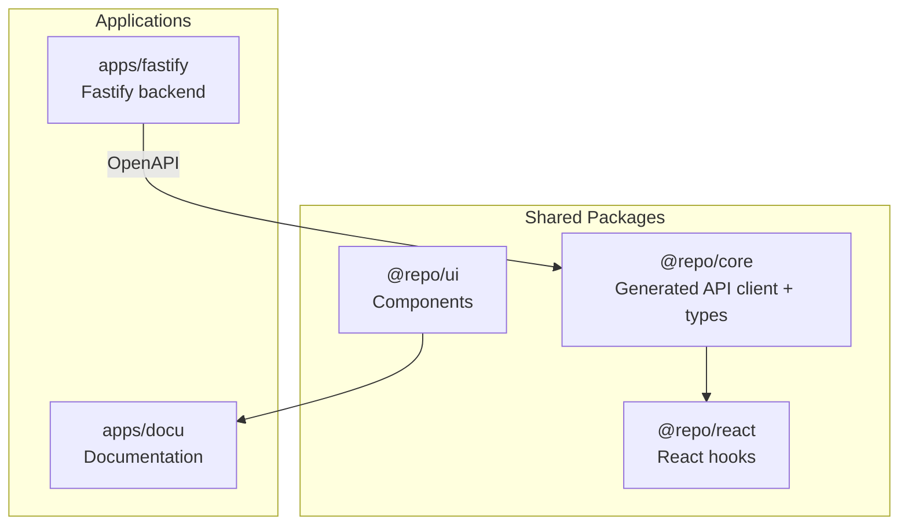

## Prerequisites

### Install Node.js

Install and set Node.js 22 as default using nvm:

```bash
curl -o- https://raw.githubusercontent.com/nvm-sh/nvm/v0.40.4/install.sh | bash
export NVM_DIR="$HOME/.nvm"
[ -s "$NVM_DIR/nvm.sh" ] && \. "$NVM_DIR/nvm.sh" # This loads nvm

nvm install 22 && nvm alias default 22
```

### Install pnpm

If you don't have pnpm installed, install it using one of the following methods:

**Using npm:**
```bash
npm install -g pnpm@10.28.0
```

**Using corepack (recommended):**
```bash
corepack enable
corepack prepare pnpm@10.28.0 --activate
```

**Using standalone script:**
```bash
curl -fsSL https://get.pnpm.io/install.sh | sh -
```

Verify your installation:
```bash
pnpm --version
```

## Quick Start

### 1. Clone and Setup

```bash
git clone <repository-url>
cd <project-name>
pnpm run setup
```

The setup script runs, in order:

- pnpm install – installs workspace dependencies
- npx simple-git-hooks – configures git hooks (e.g. pre-commit)
- pnpm setup:security – installs gitleaks and OSV scanner
- pnpm setup:evm – installs Foundry for EVM contracts
- pnpm setup:solana – installs Anchor for Solana
- pnpm setup:database – sets up the database ( docker + supabase )

Together this brings the monorepo to a working dev environment with security tooling, blockchain tooling, and the database.

### 2. Environment variables

- copy fastify/.env-sample over to fastify/.env and update the values

### 3. Explore the Running Apps 

```bash
pnpm dev
```

This will start the main applications and the packages in watch mode. 

- **API**: http://localhost:3001 (`GET /health`, `/reference` for docs)
- **Next**: http://localhost:3000 (Next.js app)

To run the docs site: `pnpm --filter @repo/docu dev` (e.g. http://localhost:3002).

### 4. Understand the Structure

**Apps:** `apps/fastify/` (Fastify backend), `apps/next/` (Next.js frontend), `apps/docu/` (documentation)

**Packages:** `core/` (generated API client + types), `react/` (React Query hooks), `ui/` (components), `sentry/` (Sentry integration), `utils/` (utilities)



## Next Steps

**Continue your AI-assisted development setup:**
- [Installation](/docs/development) - Environment variables and optional database setup
- [AI Workflow](/docs/development/ai-workflow) - Recommended development workflow
- [Cursor Setup](/docs/development/cursor-setup) - Configure your IDE

**Understand Core Concepts:**
- [Architecture](/docs/architecture) - Monorepo structure, API architecture, and OpenAPI generation
- [Architecture](/docs/architecture) - Deep technical details and design decisions

**Optional Setup:**

For database features, you'll need PostgreSQL. See [Installation](/docs/development).

For EVM contract development, install Foundry. See [EVM Contracts](/docs/blockchain/evm-contracts).
For Solana contract development, install Anchor. See [Solana Contracts](/docs/blockchain/solana-contracts).
