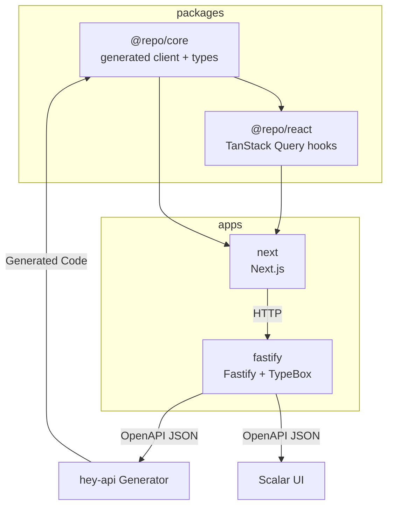

## Overview

This document defines conventions for a **TypeScript + ESM** monorepo with:

- **Fastify + TypeBox** for HTTP + schemas
- **OpenAPI** generated from route schemas
- **@hey-api/openapi-ts** for the generated TypeScript client (in `@repo/core`)
- **Zod** for generated schemas and runtime validation (when needed)
- **TanStack Query** for React async state (in `@repo/react`)

Goals: **clean boundaries**, **no duplicated sources of truth**, **portable packages**, and a **fast DX** in a pnpm workspace.

## Why this architecture

We want three outcomes at the same time:

1. **Single source of truth** for API shapes (request/response) with runtime validation.
2. Apps across the monorepo can import types safely without dragging server/runtime dependencies everywhere.
3. Packages compile to clean ESM artifacts for npm (but we can still do fast local dev in the monorepo).

The key idea:

- **Fastify routes + TypeBox schemas** are the source of truth.
- The **OpenAPI spec** is generated from routes.
- `@repo/core` contains the **generated client + types** and a small wrapper API.
- `@repo/react` is a **React Query layer** on top of `@repo/core` (handwritten hooks/components).

## Workspace layout

This repository is a pnpm workspace with these top-level groups:

```text
apps/       # product apps (Next.js, Fastify, docs site)
packages/   # shared libraries published as @repo/*
tools/      # shared tooling (eslint, typescript config, etc.)
contracts/  # smart contracts (excluded from some turbo pipelines)
```

## Package layout

```
packages/
  core/        # generated client + types (runtime-agnostic)
  react/       # TanStack Query hooks + React utilities (built on core)
apps/
  fastify/     # Fastify server + TypeBox routes → generates OpenAPI
  next/        # Next.js app consuming core/react
```

### Dependency direction (strict)

- `@repo/core` → owns generated code, exports API types
- `@repo/react` → depends on `@repo/core` (and React/TanStack Query via peer deps)

No reverse dependencies.

## Mermaid architecture diagram



## Package responsibilities (high level)

### 1) API contracts (TypeBox → OpenAPI)

The **HTTP boundary** is defined by Fastify route schemas (TypeBox). The OpenAPI spec is a **generated artifact**.

**What goes here**

* Route schemas + handlers in `apps/fastify/src/routes/`
* Generated OpenAPI 3.0 file at `apps/fastify/openapi/openapi.json` (do not hand-edit)
* Served OpenAPI JSON at `/reference/openapi.json` and Scalar UI at `/reference`

See **[OpenAPI Generation](/docs/development/openapi-generation)** for the exact workflow.

### 2) `packages/core`

The **runtime-agnostic** client package with generated OpenAPI client code and types.

**What goes here**

- Generated TypeScript client code from the OpenAPI spec (via `@hey-api/openapi-ts`)
- Types and Zod schemas generated from OpenAPI
- `createClient()` and `createApi()` wrappers (see `packages/core/README.md`)

**Hard rules**

- ✅ No React
- ✅ No TanStack Query
- ✅ Generated code lives in `packages/core/src/gen/`
- ✅ All OpenAPI types are re-exported from `@repo/core` (via `export type * from './gen/types.gen'`)

### 3) `packages/react`

React-only helpers using **TanStack Query**.

**What goes here**

- React Query hooks that call `@repo/core` (handwritten)
- Shared provider/context to supply a core client instance to hooks
- Small React utilities/components that are reusable across apps

**Hard rules**

* ✅ React-only dependencies live here
* ✅ `@tanstack/react-query` is a peer dependency (apps own the version)

## Server implementation generates OpenAPI

The server app (`apps/fastify`) should treat **Fastify routes + TypeBox schemas** as the source of truth.

1. Define request/response schemas in the route (TypeBox)
2. Generate OpenAPI from routes into `apps/fastify/openapi/openapi.json`
3. Expose OpenAPI JSON at `/reference/openapi.json`
4. Mount Scalar UI at `/reference`

## Import and export conventions

### Use only public entrypoints

- Import from the package root or an exported subpath.
- Never deep-import internal files (e.g. `@repo/core/src/...`).
- See **[Packages Reference](/docs/development/packages)** for the canonical list of entrypoints.

For `@repo/utils`, prefer subpath imports even though a root barrel exists:

```ts
import { delay } from '@repo/utils/async'
import { logger } from '@repo/utils/logger'
import { getErrorMessage } from '@repo/utils/error'
```

## Dependency management strategy

Pick dependency types based on *who should own the version*:

- **App/framework deps → peerDependencies**: React, React DOM, TanStack Query, Next.js, etc.
- **Tightly-coupled internal deps → dependencies**: shared UI building blocks, generated code wrappers.
- **Optional integrations → optional peerDependencies**: e.g. Sentry SDKs.

Rule of thumb:

```text
If the consumer must control it → peerDependency
If the library cannot function without it → dependency
If it is used only in dev/test/build → devDependency
```

Also: list peer deps in `devDependencies` too so the package type-checks and tests in isolation.

## Adding a new API endpoint (checklist)

When you add or change an endpoint:

1. Add/update the Fastify route + TypeBox schemas in `apps/fastify/src/routes/**`
2. Regenerate OpenAPI: `pnpm --filter @repo/fastify generate:openapi`
3. Regenerate the core client: `pnpm --filter @repo/core generate`
4. If you want a React Query wrapper, add/update a hook in `packages/react/src/hooks/`
5. Consume the types from `@repo/core` (single source of truth)

## Multi-language SDK philosophy

**TypeScript consumers** use generated clients from `@hey-api/openapi-ts` for full type safety.

**Other languages** (Go, Rust, Python) generate SDKs from the same OpenAPI spec when needed.

This gives us:
- ✅ Generated TypeScript clients with full type safety
- ✅ Consistent API contracts across all languages
- ✅ OpenAPI always available for non-TS consumers

See:
- **[API Architecture](/docs/architecture/api)** for the end-to-end flow (TypeBox → OpenAPI → clients/hooks)
- **[OpenAPI Generation](/docs/development/openapi-generation)** for the exact commands and generated output locations

## ESM & TypeScript strategy

This monorepo is **ESM-first** and uses **source exports in-workspace** with a **publish switch to `dist/`** (plus subpath exports and runtime-aware config for Next.js vs Node).

All the details (export maps, `prepack`/`postpack`, subpath exports, Next.js `transpilePackages`, Node dev with `tsx`, TypeScript module resolution) live in:

- **[ESM & TypeScript Strategy](/docs/architecture/esm-strategy)**

## Summary

* **Fastify routes + TypeBox schemas** are the source of truth; OpenAPI is generated from routes.
* `@repo/core` owns generated client code + types; apps import types from it.
* `@repo/react` is the React Query layer built on top of `@repo/core`.
* Prefer subpath exports when available; never deep-import internal files.
* ESM everywhere (see **[ESM & TypeScript Strategy](/docs/architecture/esm-strategy)**).

## Related

- **[Packages Reference](/docs/development/packages)**
- **[OpenAPI Generation](/docs/development/openapi-generation)**
- **[API Architecture](/docs/architecture/api)**
